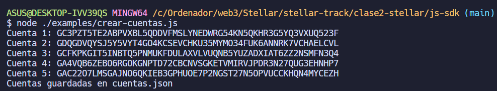
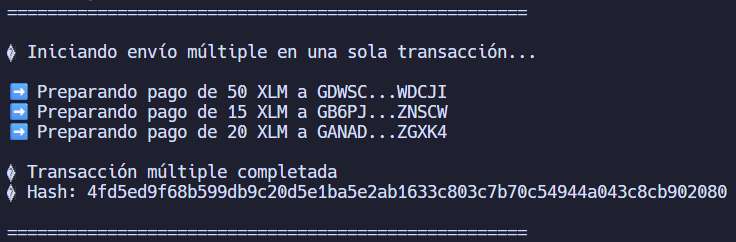
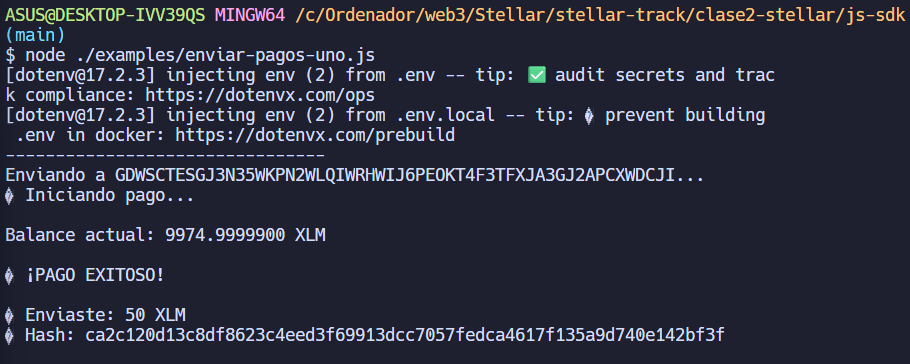
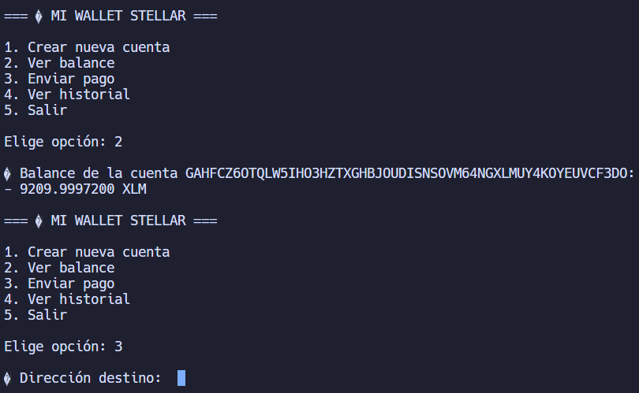

# Fundamentos de Stellar 🦈💗
## Instalación y Configuración
### Requisitos Previos
- Node.js y npm
- Editor de código (VSCode recomendado)
- Cuenta en Stellar Testnet

### Instalación de Dependencias
```bash
npm install @stellar/stellar-sdk
```

## Conceptos Aprendidos
1. **SDK de Stellar**: Es una biblioteca que facilita la interacción con la red Stellar. Permite crear y gestionar cuentas, realizar transacciones, y más.
2. **Cuentas en Stellar**: Cada usuario en la red Stellar tiene una cuenta única identificada por una clave pública y una clave secreta.
3. **Transacciones**: Son operaciones que modifican el estado de la red, como transferencias de activos o creación de cuentas.
4. **Testnet**: Es una red de prueba que simula la red principal de Stellar, permitiendo a los desarrolladores probar sus aplicaciones sin usar dinero real.
5. **Horizon**: Es la API de Stellar que permite a las aplicaciones interactuar con la red Stellar de manera sencilla.
6. **Límites de Cuenta**: Cada cuenta en Stellar tiene ciertos límites, como el número máximo de operaciones por segundo y el saldo mínimo requerido para mantener la cuenta activa.

## Estructura del Proyecto
```
clase2-stellar/
|--/img
|--/js-sdk
|  |-- examples/
|  |-- node_modules/
|  |-- mi-wallet.js
```

## Ejercicios Realizados

### Ejercicio 1: Creación Masiva de Cuentas
- Utilizando el SDK de Stellar, se creó un script para generar múltiples cuentas en la Testnet.
- **Archivo:** crear-cuentas.js
```javascript
function createMultipleAccounts(numAccounts) {
  const accounts = [];
  for (let i = 0; i < numAccounts; i++) {
    const pair = Keypair.random();
    if(!isPublicKeyValid(pair.publicKey())) {
      throw new Error("Clave pública inválida generada");
    }
    ...
  }
  return accounts;
}
```


### Ejercicio 2: Enviar pagos a múltiples cuentas
- Se desarrolló un script para enviar pagos desde una cuenta principal a varias cuentas.
- **Archivo:** enviar-pagos-diferentes.js
```javascript
async function enviarVariosPagos(destinations) {
  for(const dest of destinations) {
    console.log ('--------------------------------');
    console.log(`Enviando a ${dest.address}...`);
    await enviarPago(dest.address, dest.amount, `Pago a ${dest.address.slice(0, 5)}...`);
  }
  ...
}
```


### Ejercicio 3: Enviar pagos en una sola transacción
- Se implementó un script para enviar múltiples pagos en una sola transacción.
- **Archivo:** enviar-pagos-diferentes.js
```javascript
async function enviarPagosEnUnaTransaccion(destinations) {
  console.log('====================================================\n');

  try {
    console.log('🚀 Iniciando envío múltiple en una sola transacción...\n');
    ...
    // Construir transacción con múltiples operaciones
    let builder = new TransactionBuilder(sourceAccount, {
      fee: BASE_FEE * destinations.length,
      networkPassphrase
    });

    for (const dest of destinations) {
      builder = builder.addOperation(Operation.payment({
        destination: dest.address,
        asset: Asset.native(),
        amount: dest.amount.toString()
      }));
      console.log(`➡️  Preparando pago de ${dest.amount} XLM a ${dest.address.slice(0, 5)}...${dest.address.slice(-5)}`);
    }
    transaction.sign(sourceKeys);

    const result = await server.submitTransaction(transaction);
  ...
  }
}
```


### Ejercicio Miniproject: Crear un monedero simple
- Se creó un monedero básico que permite generar una cuenta, consultar el saldo y enviar pagos.
- **Archivo:** mi-wallet.js
```javascript
async function menu() {
  console.log('\n=== 💼 MI WALLET STELLAR ===\n');
  console.log('1. Crear nueva cuenta');
  console.log('2. Ver balance');
  console.log('3. Enviar pago');
  console.log('4. Ver historial');
  console.log('5. Salir\n');

  rl.question('Elige opción: ', async (opcion) => {
    switch (opcion) {
      case '1':
        await crearCuenta();
        break;
      case '2':
        await verBalance();
        break;
      case '3':
        await enviarPago();
        return; // evita mostrar menú dos veces
      case '4':
        await verHistorial();
        break;
      case '5':
        console.log('\n👋 Saliendo de Mi Wallet Stellar...');
        rl.close();
        return;
      default:
        console.log('❌ Opción no válida.');
    }
    menu();
  });
```

