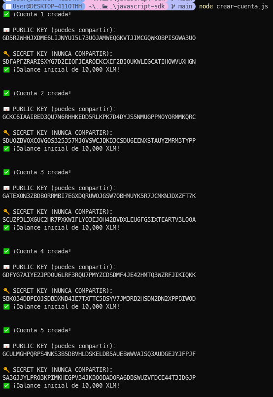
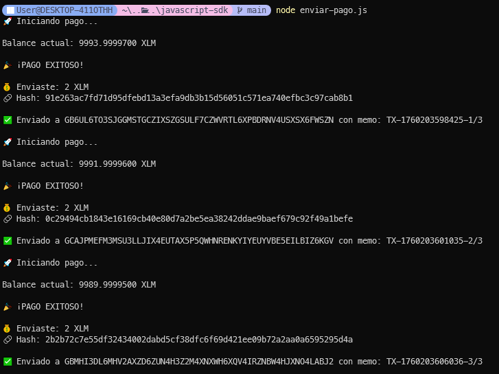
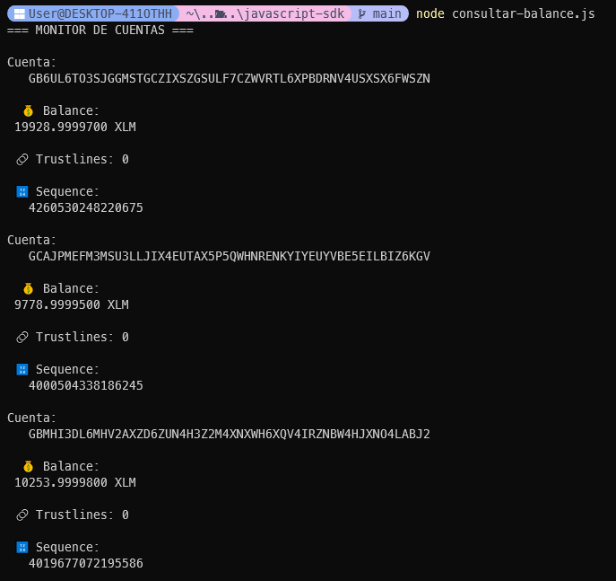

## Tarea 2 de la Semana 1 - Gianella Coronel

En este PR se evidencia la tarea realizada con los recursos y la explicación brindada por las tiburonas de Código Futura

### Archivos a visualizar
* crea-cuenta.js: Creación Masiva de Cuentas
* enviar-pago.js: Sistema de Pagos Automatizado
* consultar-balance.js: Monitor de Balances

### Pasos para ejecutar un archivo
1. Ubicarte dentro de la carpeta gianella-coronel/javascript-sdk
2. Ejecutar en la terminal el comando **npm install**
3. Ejecutar en la terminal el comando **node _nombre-del-archivo.js_**

----------------------------------------------------------------------
## Ejercicio 1: Creación Masiva de Cuentas

## Ejercicio 2: Sistema de Pagos Automatizado

## Ejercicio 3: Monitor de Balances
