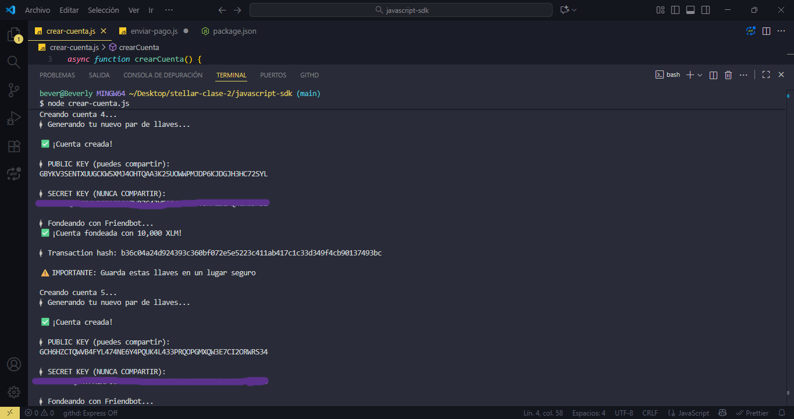
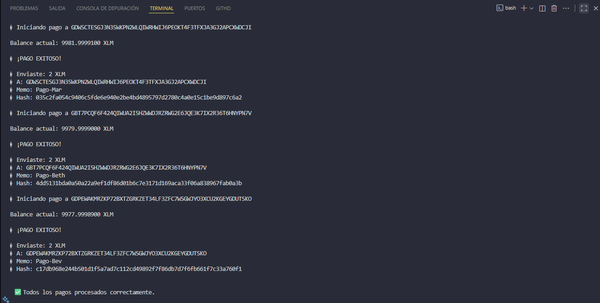
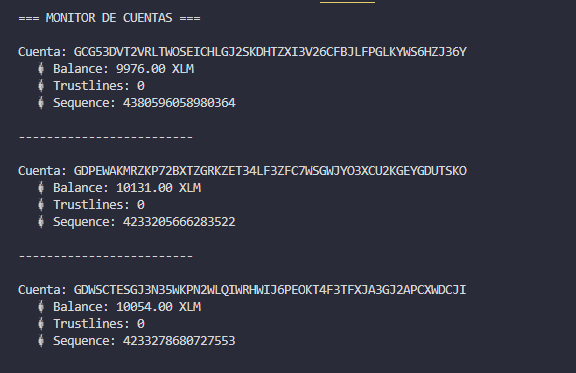

# 📝 TAREA CLASE 2 - FUNDAMENTOS DE PROGRAMACIÓN STELLAR  


    Curso: Código Futura | 🦈 Tiburona Builder 2025  
    Clase: Semana 1 - Fundamentos de Stellar SDK  

---
**Objetivo general:** Consolidar los conocimientos de **JavaScript + Stellar SDK** mediante la creación de scripts funcionales sobre la **Stellar Testnet**.

---

### 🎓 Objetivos Principales  
- **Consolidar** conocimientos sobre cuentas, transacciones y balances en Stellar  
- **Ganar confianza** interactuando con la blockchain en tiempo real  
- **Prepararse** para escribir Smart Contracts con Rust y Soroban  
- **Fomentar el pensamiento lógico** y las buenas prácticas de desarrollo  


---

## 📂 ESTRUCTURA DEL PROYECTO  
```
stellar-sdk-js-clase2
├── img/
├── .gitignore
├── crear-cuenta.js
├── enviar-pago.js
├── consultar-balance.js
├── package.json
├── package-lock.json
└── README.md
```

## 🚀 EJERCICIOS DESARROLLADOS  


### ⚙️ Ejercicio 1: Creación Masiva de Cuentas  
**Archivo:** `crear-cuenta.js`  

**Objetivo:** Generar automáticamente 5 cuentas en la red de prueba, fondearlas con Friendbot y mostrar información de cada una.  

**Requisitos:**  
✅ Generación automática de 5 *keypairs*  
✅ Fondeo con Friendbot  
✅ Impresión de Public y Secret Keys  
✅ Verificación de balance inicial  

📸 *Captura del desarrollo:*


---
### 💸 Ejercicio 2: Sistema de Pagos Automatizado  
**Archivo:** `enviar-pago.js`  

**Objetivo:** Implementar un sistema que realice **3 pagos consecutivos de 2 XLM** con validación de éxito antes de cada siguiente envío.  

**Requisitos:**  
✅ Envío de 2 XLM a 3 destinatarios  
✅ Uso de memos únicos por transacción  
✅ Verificación de éxito antes de continuar  
✅ Hash visible para seguimiento  


📸 *Captura del desarrollo:*



---

### 🔍 Ejercicio 3: Monitor de Balances  
**Archivo:** `consultar-balance.js`  

**Objetivo:** Consultar y mostrar balances, trustlines y secuencias de múltiples cuentas.  

**Requisitos:**  
✅ Lectura de array de public keys  
✅ Cálculo de balance XLM  
✅ Conteo de trustlines activos  
✅ Obtención de número de secuencia  
✅ Salida formateada  


📸 *Captura del desarrollo:* 




### 1️⃣ Clonar el repositorio  
```bash
git clone https://github.com/tuusuario/stellar-clase-2.git
cd stellar-clase-2
```

### 2️⃣ Instalar dependencias
```
npm install @stellar/stellar-sdk dotenv
```

### 3️⃣ Crear archivo `.env`

```env
PUBLIC_KEY=GXXXX
SECRET_KEY=SXXXX
```
### 4️⃣ Ejecutar cada script
```bash
node crear-cuenta.js
node enviar-pago.js
node consultar-balance.js
```

---
## 🦈 SOBRE EL CURSO: CÓDIGO FUTURA | TIBURONA BUILDER 2025

**Organizado por:**  
💙 Buen Día Builders  
💫 Stellar Development Foundation

**Mentoras:**

    🌟 Elisa Araya  
    🌟 Tatiana Borda

**Objetivos del programa:**  
✅ Escribir tu primer Smart Contract en Rust  
✅ Deployar dApps reales en Stellar  
✅ Construir un portfolio blockchain  
✅ Unirte a una red de mujeres líderes en tecnología

### 🙏 AGRADECIMIENTOS

A las instructoras, compañeras y comunidad Tiburona Builder 2025 por compartir conocimiento, apoyo y motivación durante el desarrollo de esta tarea.

---
    🌊 “Sigue nadando, Tiburona — cada bloque te acerca al futuro.” 🦈⚡
---