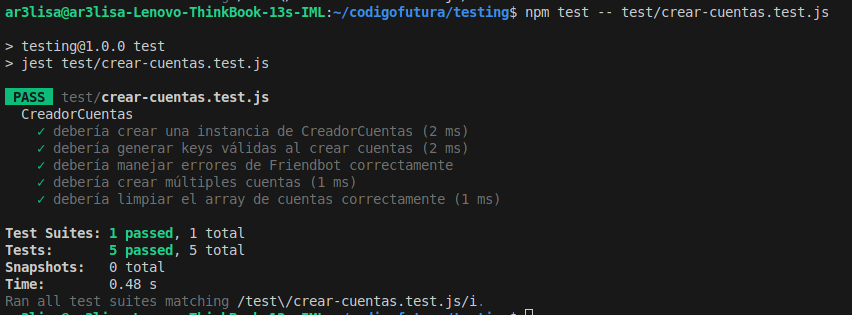
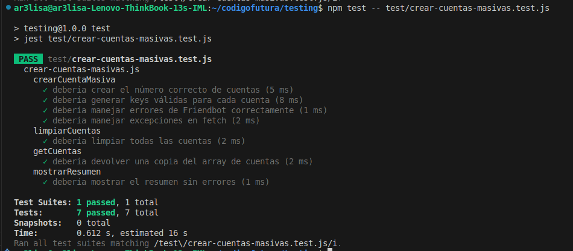
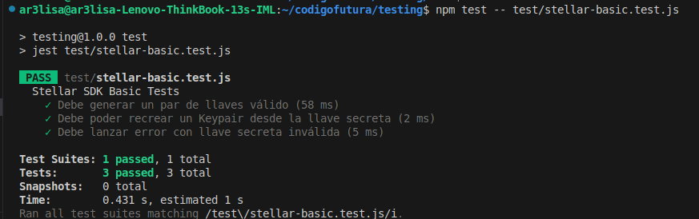

# 🚀 Testing con Stellar SDK - Guía para Tiburonas

Este proyecto es una introducción práctica a testing con **Stellar SDK** usando **JavaScript** y **Jest**.

---

## 📋 Prerrequisitos

- Node.js (versión 16 o superior)  
- npm (viene con Node.js)  
- Conocimientos básicos de JavaScript  

---

## 🛠️ Configuración Paso a Paso

## Paso 1: Crear la estructura del proyecto


### Crear carpeta principal

mkdir testing

cd testing

### Crear carpeta para tests
mkdir test

## Paso 2: Inicializar el proyecto Node.js

```bash
npm init -y
```

## Paso 3: Instalar dependencias

```bash
# Instalar Stellar SDK
npm install @stellar/stellar-sdk

# Instalar Jest para testing
npm install --save-dev jest
```
## Paso 4: Configurar Jest

Crear archivo `jest.config.js`:

```bash
module.exports = {
  testEnvironment: 'node',
  testMatch: [
    '**/test/**/*.test.js'
  ]
};
```

## Paso 5: Configurar scripts en package.json

Modificar la sección `"scripts"` en `package.json`:

```bash
{
  "scripts": {
    "test": "jest",
    "test:watch": "jest --watch"
  }
}
```

## 📁 Estructura de este proyecto Proyecto

```bash
testing/
├── package.json
├── jest.config.js
├── node_modules/
└── test/
    ├── test-stellar.js          # Test simple original
    └── stellar-basic.test.js    # Tests profesionales
```
## 🏃‍♀️ Ejecutar Tests

### Ejecutar todos los tests

```bash
npm test
```

### Ejecutar tests en modo watch (desarrollo)

```bash
npm run test:watch
```

### Ejecutar test simple individual

```bash
npm test -- test/stellar-basic.test.js
```
## Test Básico


## Crear Cuentas



## Crear Cuentas Masivas



## Enviar Pagos Masivos

