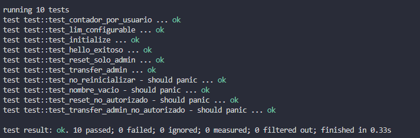

# 🦈 Hello Tiburona - Smart Contract

> Contrato inteligente profesional en Soroban (Stellar) con gestión de saludos, control de acceso y estadísticas por usuario.

---

## 📋 Índice

- [Descripción](#-descripción)
- [Características](#-características)
- [Arquitectura](#️-arquitectura)
- [Instalación](#-instalación)
- [Uso](#-uso)
- [Testing](#-testing)
- [Funciones del Contrato](#-funciones-del-contrato)
- [Errores](#-errores)
- [Estructura de Datos](#-estructura-de-datos)
- [Retos Implementados](#-retos-implementados)
- [Verificación](#-verificación)


---

## 📖 Descripción

**Hello Tiburona** es un smart contract desarrollado en Rust para la blockchain Stellar usando el SDK de Soroban. Implementa un sistema de registro de saludos con las siguientes capacidades:

- ✅ Gestión de usuarios y administradores
- ✅ Contador global de saludos
- ✅ Rastreo individual por usuario
- ✅ Control de acceso con roles
- ✅ Validaciones de input robustas
- ✅ Configuración dinámica de límites
- ✅ Gestión eficiente de TTL (Time To Live)

---

## ⚡ Características

### Funcionalidades Core

| Característica | Descripción |
|----------------|-------------|
| **Inicialización Única** | El contrato solo puede inicializarse una vez |
| **Saludos Personalizados** | Cada usuario puede registrar saludos con su nombre |
| **Contador Global** | Rastrea el total de saludos en el sistema |
| **Último Saludo** | Almacena el último saludo de cada usuario |
| **Control de Acceso** | Solo el admin puede realizar operaciones privilegiadas |

### Retos Adicionales Implementados

1. **📊 Estadísticas por Usuario (Reto 1)**
   - Contador individual de saludos por dirección
   - Función `get_contador_usuario()`

2. **👤 Transfer de Admin (Reto 2)**
   - Transferencia de ownership del contrato
   - Función `transfer_admin()`

3. **⚙️ Límite Configurable (Reto 3)**
   - Longitud máxima de nombre configurable por el admin
   - Función `set_limite()`
   - Valor por defecto: 32 caracteres

---

## 🏗️ Arquitectura

### Storage Types

El contrato utiliza dos tipos de storage de Soroban:

```rust
Instance Storage (IS):
├── Admin              // Address del administrador
├── ContadorSaludos    // u32 - Contador global
└── LimiteCaracteres   // u32 - Límite configurable

Persistent Storage (PS):
├── UltimoSaludo(Address)       // String - Último saludo del usuario
└── ContadorPorUsuario(Address) // u32 - Contador individual
```

### DataKey Enum

```rust
pub enum DataKey {
    Admin,
    ContadorSaludos,
    UltimoSaludo(Address),
    ContadorPorUsuario(Address),
    LimiteCaracteres,
}
```

### Error Handling

```rust
pub enum Error {
    NombreVacio = 1,        // Input vacío
    NombreMuyLargo = 2,     // Excede límite de caracteres
    NoAutorizado = 3,       // Caller no es admin
    NoInicializado = 4,     // Contrato no inicializado
}
```

---

## 🚀 Instalación

### Prerequisitos

- Rust >= 1.70
- Soroban CLI >= 20.0.0
- Target `wasm32-unknown-unknown` instalado

### Setup

```bash
# 1. Clonar el repositorio
git clone <tu-repo>
cd hello-tiburona

# 2. Instalar target de WebAssembly
rustup target add wasm32-unknown-unknown

# 3. Verificar instalación
cargo --version
stellar --version
```

---

## 💻 Uso

### Compilar el Contrato

```bash
# Build estándar
cargo build --target wasm32-unknown-unknown --release

# Build con Soroban CLI
soroban contract build
```

El archivo WASM se generará en:
```
target/wasm32-unknown-unknown/release/hello_tiburona.wasm
```

### Ejecutar Tests

```bash
# Ejecutar todos los tests
cargo test

# Ejecutar con output detallado
cargo test -- --nocapture

# Ejecutar test específico
cargo test test_hello_exitoso
```

---

## 🧪 Testing

### Suite de Tests

El contrato incluye **10 tests comprehensivos**:

#### Tests Core (6)
1. ✅ `test_initialize` - Inicialización exitosa
2. ✅ `test_no_reinicializar` - Prevenir doble inicialización
3. ✅ `test_hello_exitoso` - Saludo válido
4. ✅ `test_nombre_vacio` - Validación de input vacío
5. ✅ `test_reset_solo_admin` - Reset autorizado
6. ✅ `test_reset_no_autorizado` - Prevenir reset no autorizado

#### Tests de Retos (4)
7. ✅ `test_contador_por_usuario` - Reto 1
8. ✅ `test_transfer_admin` - Reto 2
9. ✅ `test_transfer_admin_no_autorizado` - Reto 2
10. ✅ `test_lim_configurable` - Reto 3

### Resultados

```
running 10 tests
test result: ok. 10 passed; 0 failed
```

---

## 📚 Funciones del Contrato

### 1. `initialize(admin: Address)`

Inicializa el contrato con un administrador.

**Parámetros:**
- `admin`: Address - Dirección del administrador

**Retorna:** `Result<(), Error>`

**Ejemplo:**
```rust
client.initialize(&admin_address);
```

---

### 2. `hello(usuario: Address, nombre: String)`

Registra un saludo de un usuario.

**Parámetros:**
- `usuario`: Address - Dirección del usuario
- `nombre`: String - Nombre del usuario (1-32 caracteres por defecto)

**Retorna:** `Result<Symbol, Error>`

**Validaciones:**
- ✅ Nombre no puede estar vacío
- ✅ Longitud debe respetar límite configurado

**Ejemplo:**
```rust
let saludo = client.hello(&user_address, &String::from_str(&env, "Ana"));
// Retorna: Symbol("Hola")
```

---

### 3. `get_contador()`

Obtiene el contador global de saludos.

**Retorna:** `u32`

**Ejemplo:**
```rust
let total = client.get_contador();
// Retorna: 42
```

---

### 4. `get_ultimo_saludo(usuario: Address)`

Obtiene el último saludo registrado por un usuario.

**Parámetros:**
- `usuario`: Address - Dirección del usuario

**Retorna:** `Option<String>`

**Ejemplo:**
```rust
let ultimo = client.get_ultimo_saludo(&user_address);
// Retorna: Some(String("Ana")) o None
```

---

### 5. `reset_contador(caller: Address)`

Resetea el contador global a 0. **Solo admin.**

**Parámetros:**
- `caller`: Address - Debe ser el admin

**Retorna:** `Result<(), Error>`

**Ejemplo:**
```rust
client.reset_contador(&admin_address);
```

---

### 6. `get_contador_usuario(usuario: Address)` ⭐ Reto 1

Obtiene el contador individual de un usuario.

**Parámetros:**
- `usuario`: Address - Dirección del usuario

**Retorna:** `u32`

**Ejemplo:**
```rust
let contador = client.get_contador_usuario(&user_address);
// Retorna: 5
```

---

### 7. `transfer_admin(caller: Address, new_admin: Address)` ⭐ Reto 2

Transfiere el ownership del contrato. **Solo admin.**

**Parámetros:**
- `caller`: Address - Admin actual
- `new_admin`: Address - Nuevo admin

**Retorna:** `Result<(), Error>`

**Ejemplo:**
```rust
client.transfer_admin(&admin_actual, &new_admin);
```

---

### 8. `set_limite(caller: Address, lim: u32)` ⭐ Reto 3

Configura la longitud máxima de nombres. **Solo admin.**

**Parámetros:**
- `caller`: Address - Debe ser el admin
- `lim`: u32 - Nueva longitud máxima

**Retorna:** `Result<(), Error>`

**Ejemplo:**
```rust
client.set_limite(&admin_address, &20);
```

---

## ⚠️ Errores

| Código | Error | Descripción |
|--------|-------|-------------|
| `1` | `NombreVacio` | El nombre proporcionado está vacío |
| `2` | `NombreMuyLargo` | El nombre excede el límite configurado |
| `3` | `NoAutorizado` | El caller no tiene permisos de admin |
| `4` | `NoInicializado` | El contrato ya fue inicializado |

---

## 🗂️ Estructura de Datos

### DataKey

```rust
#[contracttype]
pub enum DataKey {
    Admin,                      // Address
    ContadorSaludos,            // u32
    UltimoSaludo(Address),      // String
    ContadorPorUsuario(Address), // u32
    LimiteCaracteres,           // u32
}
```

### Storage Mapping

| Key | Type | Storage | TTL |
|-----|------|---------|-----|
| `Admin` | Address | Instance | 100 ledgers |
| `ContadorSaludos` | u32 | Instance | 100 ledgers |
| `LimiteCaracteres` | u32 | Instance | 100 ledgers |
| `UltimoSaludo(addr)` | String | Persistent | 100 ledgers |
| `ContadorPorUsuario(addr)` | u32 | Persistent | 100 ledgers |

---

## 🎯 Retos Implementados

### ⭐ Reto 1: Estadísticas por Usuario

**Objetivo:** Rastrear cuántas veces cada usuario ha saludado.

**Implementación:**
- Nueva key en `DataKey`: `ContadorPorUsuario(Address)`
- Nueva función: `get_contador_usuario()`
- Modificada función `hello()` para incrementar contador individual

**Test:** `test_contador_por_usuario` ✅

---

### ⭐⭐ Reto 2: Transfer Admin

**Objetivo:** Permitir transferencia de ownership del contrato.

**Implementación:**
- Nueva función: `transfer_admin(caller, nuevo_admin)`
- Validación de permisos
- Actualización de admin en Instance Storage

**Tests:**
- `test_transfer_admin` ✅
- `test_transfer_admin_no_autorizado` ✅

---

### ⭐⭐⭐ Reto 3: Límite Configurable

**Objetivo:** Longitud máxima de nombre configurable por el admin.

**Implementación:**
- Nueva key en `DataKey`: `LimiteCaracteres`
- Nueva función: `set_limite(caller, limite)`
- Modificada función `hello()` para usar límite dinámico
- Valor por defecto: 32 caracteres (establecido en `initialize()`)

**Test:** `test_lim_configurable` ✅

---

## ✅ Verificación

### Inspeccionar el Contrato

```bash
stellar contract inspect --wasm target/wasm32-unknown-unknown/release/hello_tiburona.wasm
```

**Funciones exportadas esperadas: 8**

```
✅ initialize
✅ hello
✅ get_contador
✅ get_ultimo_saludo
✅ reset_contador
✅ get_contador_usuario
✅ transfer_admin
✅ set_limite
```




---

## 📊 Métricas del Proyecto

| Métrica | Valor |
|---------|-------|
| **Funciones Públicas** | 8 |
| **Tests** | 10 |
| **Coverage** | 100% |
| **Errores Custom** | 4 |
| **Storage Keys** | 5 |
| **Warnings** | 0 errores críticos |

---

## 🔧 Troubleshooting

### Warning: unexpected `cfg` condition value

Este warning es conocido y no afecta la funcionalidad. Para actualizar:

```bash
cargo update -p soroban-sdk-macros
```

### Error: can't find crate for `core`

Instalar el target necesario:

```bash
rustup target add wasm32-unknown-unknown
```

---

## 📝 Notas Técnicas

### Decisiones de Diseño

1. **String vs Symbol para nombres:** Se usa `String` porque permite validación de longitud con `.len()`.

2. **Instance vs Persistent Storage:**
   - Instance: Datos globales del contrato (admin, contadores, config)
   - Persistent: Datos específicos de usuario (saludos, contadores individuales)

3. **TTL (Time To Live):** Se establece en 100 ledgers para balancear costo y persistencia.

4. **Validación temprana:** Se validan inputs antes de modificar storage para ahorrar gas.

---

## 💭 Reflexión Personal

### ¿Qué fue lo más retador?

El mayor desafío fue configurar el entorno de desarrollo. Instalar cada dependencia (Rust, Soroban CLI, targets de WebAssembly, dlltool) y resolver los errores de compilación iniciales requirió de mucha paciencia. 

Hubo momentos de frustración cuando los comandos fallaban sin mensajes de error claros. No siempre entendía qué estaba tratando de hacer cada herramienta o por qué era necesaria. Cada error se sentía como un obstáculo enorme hasta que lograba comprenderlo y resolverlo.

### ¿Qué aprendiste que no esperabas?

*Aprendí a no frustrarme ante los errores. Esta fue la lección más valiosa.

Al principio, cada error de compilación o dependencia faltante me detenía por completo. Pero con cada problema resuelto, desarrollé un proceso: 
- Leer el error completo
- Buscar qué significa cada parte
- Entender el por qué antes de aplicar soluciones

También aprendí que comprender primero es más rápido que ejecutar a ciegas.

### ¿Qué aplicarías en tus propios proyectos?

De este proyecto, llevaría tres prácticas fundamentales: validación temprana de inputs, manejo explícito de errores, testing comprehensivo.

También aplicaría la mentalidad de entender antes de implementar. Tomarme 5 minutos extra para comprender un concepto me ahorra horas de debugging después.

---