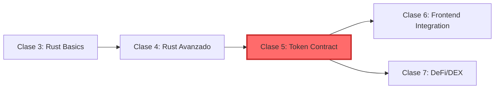

# 📚 Clase 5: Token Contract - Resumen

## 🎯 Información General
- **Tema:** Token Contract fungible en Stellar/Soroban (Estándar CAP-46)
- **Duración:** 90 minutos
- **Nivel:** Intermedio (requiere conocimiento de Rust de clases 3-4)
- **Fecha sugerida:** Martes - Semana 3

## 🏆 Objetivos de Aprendizaje
Al finalizar esta clase, las Tiburonas Builders podrán:
1. ✅ Implementar un token funcional completo en Stellar usando el estándar CAP-46
2. ✅ Entender las diferencias clave entre tokens ERC-20 (Ethereum) y Stellar
3. ✅ Escribir tests unitarios robustos para smart contracts
4. ✅ Deployar su primer token en testnet de Stellar
5. ✅ Aplicar TODO lo aprendido de Rust en un caso real de producción

## 📋 Pre-requisitos

### Conocimientos Técnicos
- ✅ **Clase 3 completada:** Dominar `Result<T, E>` y `Option<T>`
- ✅ **Clase 4 completada:** Entender traits, ownership y borrowing
- ✅ **Rust básico:** Saber usar `cargo build` y `cargo test`
- ✅ **Command line:** Navegar directorios y ejecutar comandos

### Setup Técnico
- ✅ Entorno Soroban configurado
- ✅ Cuenta en Stellar Testnet con fondos (XLM)
- ✅ Stellar CLI instalado y funcionando

> 💡 **Checkpoint pre-clase:** Clona el repo base y corre `cargo build` para verificar tu setup antes de la clase. ¡A meterle con toda la energía de un buen café latino! ☕

## Conceptos Clave

### Token en Blockchain
- Representación digital de valor que vive en la blockchain de forma descentralizada
- Puede representar: monedas, puntos de fidelidad, acciones, derechos de voto, etc.
- Inmutable una vez deployado (¡el código ES la ley!)

### Estándar CAP-46 (Stellar) 
**CAP-46 es el equivalente de ERC-20 en Stellar.** Define una interfaz estándar para tokens fungibles que asegura:
- Compatibilidad universal con wallets Stellar
- Integración automática con DEXs
- Interoperabilidad entre contratos

### Funciones Core de un Token
1. **initialize()** - Configurar el token (nombre, símbolo, decimales)
2. **mint()** - Crear nuevos tokens (solo admin)
3. **burn()** - Destruir tokens permanentemente
4. **transfer()** - Enviar tokens entre cuentas
5. **approve()** - Autorizar a otro address a gastar tus tokens
6. **balance()** - Consultar saldo de una cuenta
7. **allowance()** - Ver cuánto puede gastar un address autorizado

## 📖 Mini-Glosario
- **Mint:** Crear nuevos tokens de la nada (aumenta supply total)
- **Burn:** Destruir tokens (reduce supply total)
- **Allowance:** Permiso que das a otro address para gastar tus tokens
- **Testnet:** Red de prueba con dinero falso (XLM gratis)
- **TTL (Time To Live):** Tiempo antes de que los datos expiren en Stellar

## 🛠️ Stack Tecnológico
- **Lenguaje:** Rust (con Soroban SDK)
- **Framework:** Soroban SDK v21+
- **Red:** Stellar Testnet
- **Herramientas:** Stellar CLI, Cargo, Stellar Laboratory
- **Testing:** Built-in Rust test framework

## 📊 Comparación: ERC-20 vs CAP-46 (Stellar)

| Aspecto | ERC-20 (Ethereum) | CAP-46 (Stellar) |
|---------|-------------------|------------------|
| **Gas Fees** | $5-$50 por transacción | ~$0.00001 |
| **Velocidad** | 15 segundos | 5 segundos |
| **Lenguaje** | Solidity | Rust |
| **Storage** | Costoso ($$$) | Eficiente |
| **Upgradeable** | Vía Proxy Patterns | Nativo en Soroban |
| **Seguridad** | Reentrancy attacks | Memory-safe por Rust |

## 🏗️ Estructura del Proyecto
```
token_bdb/
├── src/
│   ├── lib.rs        # Contract principal + trait implementation
│   ├── storage.rs    # Tipos de datos y storage keys
│   ├── errors.rs     # Custom errors del contrato
│   └── test.rs       # Tests unitarios completos
├── Cargo.toml        # Dependencias (soroban-sdk, etc.)
└── README.md         # Documentación del token
```

## Agenda de la Clase (Desglose Detallado)

### Parte 1: Teoría y Contexto (15 min)
- **5 min:** ¿Qué es un token? Casos de uso reales
- **5 min:** Estándar CAP-46 vs ERC-20 (diferencias clave)
- **5 min:** Conceptos de seguridad en smart contracts

### Parte 2: Implementación Hands-On (60 min)
- **10 min:** Setup del proyecto y estructura de carpetas
- **15 min:** Definir storage keys y custom errors
- **20 min:** Implementar funciones core (initialize, mint, transfer)
- **10 min:** Implementar sistema de allowances (approve, transfer_from)
- **5 min:** Mini-desafíos interactivos (agregar función `decimals()`)

### Parte 3: Testing y Deploy (15 min)
- **8 min:** Escribir tests unitarios para cada función
- **4 min:** Deploy a testnet
- **3 min:** Verificar en Stellar Laboratory

## 💻 Preview de Código (¡Spoiler Alert!)

```rust
// Así se ve una función mint simplificada:
pub fn mint(env: Env, to: Address, amount: i128) -> Result<(), Error> {
    to.require_auth(); // Verificar autorización
    
    // Actualizar balance
    let balance = read_balance(&env, &to);
    write_balance(&env, &to, balance + amount);
    
    Ok(())
}
```

## 🚀 Entregables
Al final de la clase, cada Tiburona tendrá:
1. ✅ Token deployado en testnet con un **Contract ID único**
2. ✅ 10+ tests unitarios pasando (con casos edge)
3. ✅ Código production-ready siguiendo best practices
4. ✅ Comprensión profunda del estándar CAP-46
5. ✅ Portfolio actualizado con su primer smart contract funcional

## 💡 Tips Clave (¡Léelos dos veces!)

> **"En blockchain, el código ES la ley. Una vez deployado, no hay Ctrl+Z"**

> **"Siempre usa `Result<T, Error>` en lugar de `panic!` para production"**

> **"Extender TTL es crítico en testnet para que tus datos no expiren"**

> **"Los tests no son opcionales - son tu red de seguridad"**

## 🔗 Recursos Esenciales
- [CAP-46 Official Spec](https://stellar.org/protocol/cap-46) - Especificación completa del estándar
- [Stellar Token Documentation](https://developers.stellar.org/docs/tokens)
- [Soroban Token Example](https://github.com/stellar/soroban-examples/tree/main/token)
- [Storage y TTL Guide](https://developers.stellar.org/docs/learn/smart-contract-internals/state-archival)
- [Stellar Laboratory](https://laboratory.stellar.org/) - Para verificar contratos deployados

## 📈 Métricas de Éxito
- [ ] Token inicializado correctamente con nombre y símbolo
- [ ] Puede mintear y quemar tokens sin errores
- [ ] Transferencias funcionando entre múltiples addresses
- [ ] Sistema de allowances activo y testeado
- [ ] Todos los tests pasando (incluyendo casos edge)
- [ ] Deployado en testnet y verificado en Laboratory

## 🎯 Conexión con el Roadmap



Esta clase es el **momento crítico** donde todo lo aprendido de Rust se aplica en un contrato real y funcional.

---

## 👥 Mensaje de las Tiburonas Senior

> "¿Recuerdan cuando instalamos Rust y pensamos 'esto nunca lo voy a usar'? Miren ahora: están a 90 minutos de tener su propio token en blockchain. Eso es lo que hace especial a esta comunidad - aquí no hay imposibles, solo desafíos que vamos a conquistar juntas. ¡Nos vemos en la clase con toda la actitud! 🚀"
> 
> — *Las Tiburonas que ya pasaron por esto (y sobrevivieron para contarlo)*

---

*"De Web2 Developer a Blockchain Builder en 90 minutos 🚀"*

*¡Vamos con toda, Tiburonas! 🦈💪*