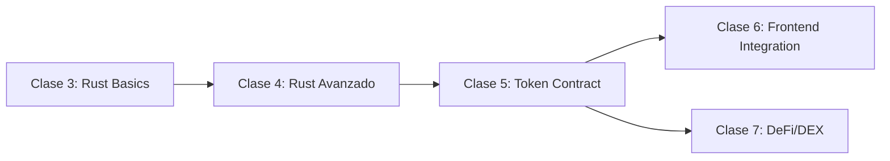

# 📚 Clase 5: Token Contract ERC-20-like - Resumen

## 🎯 Información General

- **Tema:** Token Contract ERC-20-like en Stellar/Soroban
- **Duración:** 90 minutos
- **Nivel:** Intermedio (requiere conocimiento de Rust de clases 3-4)
- **Fecha sugerida:** Martes - Semana 3

## 🏆 Objetivos de Aprendizaje

Al finalizar esta clase, las Tiburonas Builders podrán:
1. ✅ Implementar un token funcional completo en Stellar
2. ✅ Entender las diferencias entre tokens ERC-20 (Ethereum) y Stellar
3. ✅ Escribir tests unitarios para smart contracts
4. ✅ Deployar su primer token en testnet
5. ✅ Aplicar TODO lo aprendido de Rust en un caso real

## 📋 Pre-requisitos

- ✅ Haber completado Clase 3 (Rust Basics)
- ✅ Haber completado Clase 4 (Rust Avanzado)
- ✅ Tener el entorno Soroban configurado
- ✅ Cuenta en Stellar Testnet con fondos

## 🔑 Conceptos Clave

### Token en Blockchain
- Representación digital de valor
- Vive en la blockchain de forma descentralizada
- Puede representar: monedas, puntos, acciones, etc.

### Estándar CAP-46
- Estándar oficial de Stellar para tokens fungibles
- Define interfaz consistente
- Asegura compatibilidad con wallets y DEXs

### Funciones Core de un Token
1. **mint()** - Crear nuevos tokens
2. **burn()** - Destruir tokens
3. **transfer()** - Enviar tokens entre cuentas
4. **approve()** - Permitir que otro gaste tus tokens
5. **balance()** - Consultar saldo

## 🛠️ Stack Tecnológico

- **Lenguaje:** Rust
- **Framework:** Soroban SDK
- **Red:** Stellar Testnet
- **Herramientas:** Stellar CLI, Cargo

## 📊 Comparación: ERC-20 vs Stellar Tokens

| Aspecto | ERC-20 (Ethereum) | Stellar Token |
|---------|-------------------|---------------|
| **Gas Fees** | $5-$50 | ~$0.00001 |
| **Velocidad** | 15 segundos | 5 segundos |
| **Lenguaje** | Solidity | Rust |
| **Storage** | Costoso | Eficiente |
| **Upgradeable** | Via Proxy | Nativo |

## 🏗️ Estructura del Proyecto

```
token_bdb/
├── src/
│   ├── lib.rs        # Contract principal
│   ├── storage.rs    # Tipos de datos
│   ├── errors.rs     # Manejo de errores
│   └── test.rs       # Tests unitarios
└── Cargo.toml        # Dependencias
```

## ⚡ Agenda de la Clase

### Parte 1: Teoría (15 min)
- ¿Qué es un token?
- Estándar CAP-46
- Diferencias con ERC-20
- Conceptos de seguridad

### Parte 2: Implementación (60 min)
- Setup del proyecto
- Definir storage y errors
- Implementar trait del token
- Codear funciones core
- Mini-desafíos interactivos

### Parte 3: Testing (15 min)
- Tests unitarios
- Casos edge
- Tests de seguridad

## 🚀 Entregables

Al final de la clase, cada Tiburona tendrá:
1. Token deployado en testnet
2. 10+ tests pasando
3. Código production-ready
4. Comprensión profunda del estándar CAP-46

## 💡 Tips Clave

> "En blockchain, el código ES la ley. Una vez deployado, no hay Ctrl+Z"

> "Siempre usa `Result<T, Error>` en lugar de `panic!` para production"

> "Extender TTL es crítico en testnet para que tus datos no expiren"

## 🔗 Recursos Esenciales

- [Stellar Token Standards (CAP-46)](https://developers.stellar.org/docs/tokens)
- [Soroban Examples](https://github.com/stellar/soroban-examples/tree/main/token)
- [Storage y TTL](https://developers.stellar.org/docs/learn/smart-contract-internals/state-archival)

## 📈 Métricas de Éxito

- [ ] Token inicializado correctamente
- [ ] Puede mintear y quemar tokens
- [ ] Transferencias funcionando
- [ ] Sistema de allowances activo
- [ ] Todos los tests pasando
- [ ] Deployado en testnet

## 🎯 Conexión con el Roadmap



Esta clase es el **momento crítico** donde todo lo aprendido de Rust se aplica en un contrato real y funcional.

---

*"De Web2 Developer a Blockchain Builder en 90 minutos 🚀"*