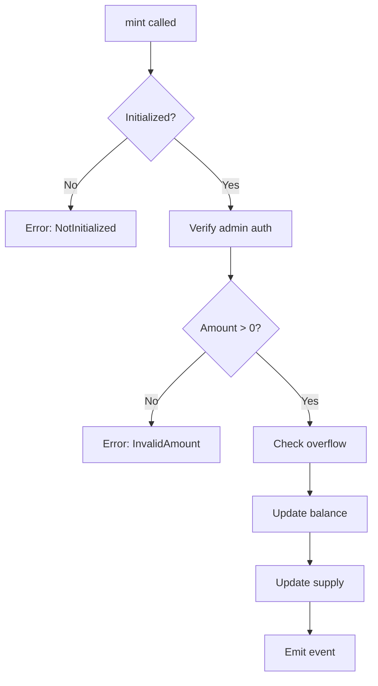
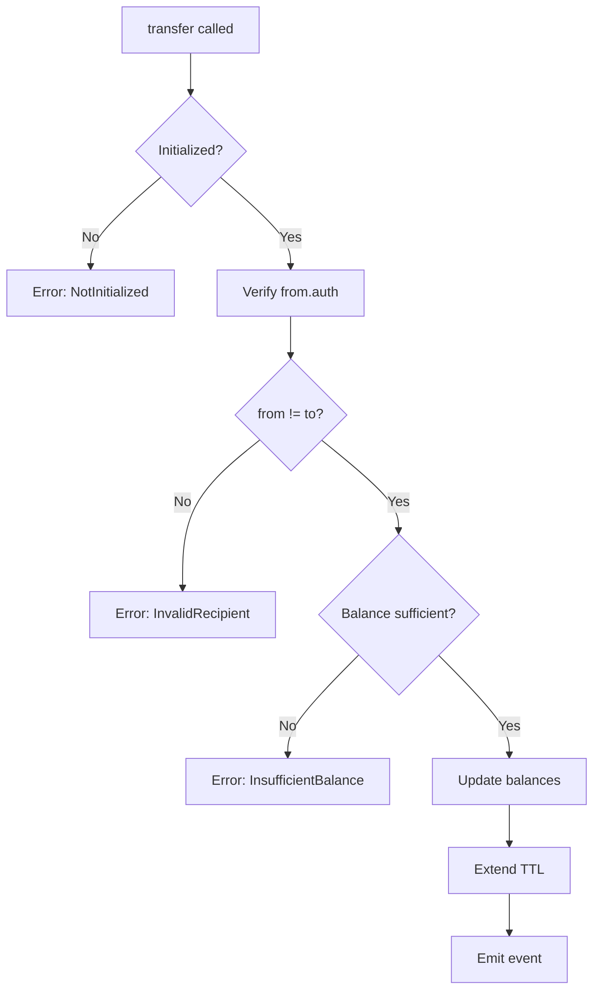

# 💻 Código Completo - Token Contract

## 📁 Estructura del Proyecto

```bash
token_bdb/
├── Cargo.toml
└── src/
    ├── lib.rs       # Contract principal
    ├── storage.rs   # Tipos de almacenamiento
    ├── errors.rs    # Manejo de errores
    └── test.rs      # Tests unitarios
```

## 1️⃣ Cargo.toml - Dependencias

```toml
[package]
name = "token_bdb"
version = "0.1.0"
edition = "2021"

[lib]
crate-type = ["cdylib"]

[dependencies]
soroban-sdk = "20.0.0"

[dev-dependencies]
soroban-sdk = { version = "20.0.0", features = ["testutils"] }

[profile.release]
opt-level = "z"
overflow-checks = true
debug = 0
strip = "symbols"
debug-assertions = false
panic = "abort"
codegen-units = 1
lto = true

[profile.release-with-logs]
inherits = "release"
debug-assertions = true
```

## 2️⃣ storage.rs - Tipos de Datos

```rust
// src/storage.rs
use soroban_sdk::{contracttype, Address};

/// Enum que define todas las claves de almacenamiento
#[contracttype]
pub enum DataKey {
    /// Balance de cada usuario - Persistent
    Balance(Address),
    
    /// Permisos de gasto entre usuarios - Persistent
    Allowance(Address, Address), // (owner, spender)
    
    /// Supply total de tokens - Instance
    TotalSupply,
    
    /// Dirección del administrador - Instance
    Admin,
    
    /// Nombre del token - Instance
    TokenName,
    
    /// Símbolo del token (BDB, USDC, etc) - Instance
    TokenSymbol,
    
    /// Número de decimales - Instance
    Decimals,
    
    /// Flag para verificar inicialización - Instance
    Initialized,
}
```

## 3️⃣ errors.rs - Manejo de Errores

```rust
// src/errors.rs
use soroban_sdk::contracterror;

/// Enum de errores personalizados para el token
#[contracterror]
#[derive(Copy, Clone, Debug, Eq, PartialEq)]
pub enum TokenError {
    /// El contrato ya fue inicializado
    AlreadyInitialized = 1,
    
    /// Amount debe ser mayor a 0
    InvalidAmount = 2,
    
    /// Balance insuficiente para la operación
    InsufficientBalance = 3,
    
    /// Allowance insuficiente para transfer_from
    InsufficientAllowance = 4,
    
    /// El contrato no ha sido inicializado
    NotInitialized = 5,
    
    /// Decimales inválidos (máximo 18)
    InvalidDecimals = 6,
    
    /// Overflow en operación aritmética
    OverflowError = 7,
    
    /// Transferencia a sí mismo no permitida
    InvalidRecipient = 8,
}
```

## 4️⃣ lib.rs - Contrato Principal

```rust
// src/lib.rs
#![no_std]

use soroban_sdk::{
    contract, contractimpl, Address, Env, String, 
    log, Symbol
};

mod storage;
mod errors;

use storage::DataKey;
use errors::TokenError;

/// Trait que define la interfaz del token
pub trait TokenTrait {
    /// Inicializa el token con metadatos y admin
    fn initialize(
        env: Env, 
        admin: Address, 
        name: String, 
        symbol: String,
        decimals: u32
    ) -> Result<(), TokenError>;
    
    /// Crea nuevos tokens (solo admin)
    fn mint(env: Env, to: Address, amount: u128) -> Result<(), TokenError>;
    
    /// Destruye tokens reduciendo el supply
    fn burn(env: Env, from: Address, amount: u128) -> Result<(), TokenError>;
    
    /// Consulta el balance de una cuenta
    fn balance(env: Env, account: Address) -> u128;
    
    /// Transfiere tokens entre cuentas
    fn transfer(
        env: Env, 
        from: Address, 
        to: Address, 
        amount: u128
    ) -> Result<(), TokenError>;
    
    /// Aprueba a otro usuario para gastar tokens
    fn approve(
        env: Env, 
        from: Address, 
        spender: Address, 
        amount: u128
    ) -> Result<(), TokenError>;
    
    /// Consulta el allowance entre dos cuentas
    fn allowance(env: Env, from: Address, spender: Address) -> u128;
    
    /// Transfiere tokens en nombre de otro usuario
    fn transfer_from(
        env: Env, 
        spender: Address, 
        from: Address, 
        to: Address, 
        amount: u128
    ) -> Result<(), TokenError>;
    
    // Métodos de consulta
    fn name(env: Env) -> String;
    fn symbol(env: Env) -> String;
    fn decimals(env: Env) -> u32;
    fn total_supply(env: Env) -> u128;
}

/// Estructura del contrato
#[contract]
pub struct TokenBDB;

/// Implementación del contrato
#[contractimpl]
impl TokenTrait for TokenBDB {
    fn initialize(
        env: Env, 
        admin: Address, 
        name: String, 
        symbol: String,
        decimals: u32
    ) -> Result<(), TokenError> {
        // Verificar que no esté inicializado
        if env.storage().instance().has(&DataKey::Initialized) {
            return Err(TokenError::AlreadyInitialized);
        }
        
        // Validar decimales (máximo 18 como Ethereum)
        if decimals > 18 {
            return Err(TokenError::InvalidDecimals);
        }
        
        // Guardar metadata en instance storage
        env.storage().instance().set(&DataKey::Admin, &admin);
        env.storage().instance().set(&DataKey::TokenName, &name);
        env.storage().instance().set(&DataKey::TokenSymbol, &symbol);
        env.storage().instance().set(&DataKey::Decimals, &decimals);
        env.storage().instance().set(&DataKey::TotalSupply, &0u128);
        env.storage().instance().set(&DataKey::Initialized, &true);
        
        // Extender TTL del storage de instance
        env.storage().instance().extend_ttl(100_000, 200_000);
        
        // Log para debugging
        log!(&env, "Token initialized: {} ({})", name, symbol);
        
        // Emitir evento rico
        env.events().publish(
            (Symbol::new(&env, "initialized"), admin.clone()),
            (name, symbol, decimals)
        );
        
        Ok(())
    }
    
    fn mint(env: Env, to: Address, amount: u128) -> Result<(), TokenError> {
        // Verificar inicialización
        if !env.storage().instance().has(&DataKey::Initialized) {
            return Err(TokenError::NotInitialized);
        }
        
        // Solo el admin puede mintear
        let admin: Address = env.storage().instance()
            .get(&DataKey::Admin)
            .ok_or(TokenError::NotInitialized)?;
        admin.require_auth();
        
        // Validaciones
        if amount == 0 {
            return Err(TokenError::InvalidAmount);
        }
        
        // Obtener balance actual y verificar overflow
        let balance = Self::balance(env.clone(), to.clone());
        let new_balance = balance.checked_add(amount)
            .ok_or(TokenError::OverflowError)?;
        
        // Actualizar balance con TTL extendido
        env.storage().persistent().set(
            &DataKey::Balance(to.clone()), 
            &new_balance
        );
        env.storage().persistent().extend_ttl(
            &DataKey::Balance(to.clone()),
            100_000,
            200_000
        );
        
        // Actualizar total supply
        let total: u128 = env.storage().instance()
            .get(&DataKey::TotalSupply)
            .unwrap_or(0);
        let new_total = total.checked_add(amount)
            .ok_or(TokenError::OverflowError)?;
        env.storage().instance().set(
            &DataKey::TotalSupply, 
            &new_total
        );
        
        // Emitir evento detallado
        env.events().publish(
            (Symbol::new(&env, "mint"), to.clone()), 
            (amount, new_balance, new_total)
        );
        
        Ok(())
    }
    
    fn burn(env: Env, from: Address, amount: u128) -> Result<(), TokenError> {
        // Verificar inicialización
        if !env.storage().instance().has(&DataKey::Initialized) {
            return Err(TokenError::NotInitialized);
        }
        
        // Requiere autorización del dueño de los tokens
        from.require_auth();
        
        if amount == 0 {
            return Err(TokenError::InvalidAmount);
        }
        
        let balance = Self::balance(env.clone(), from.clone());
        if balance < amount {
            return Err(TokenError::InsufficientBalance);
        }
        
        // Actualizar balance
        let new_balance = balance - amount;
        env.storage().persistent().set(
            &DataKey::Balance(from.clone()),
            &new_balance
        );
        
        // Actualizar total supply
        let total: u128 = env.storage().instance()
            .get(&DataKey::TotalSupply)
            .unwrap_or(0);
        let new_total = total.checked_sub(amount)
            .ok_or(TokenError::OverflowError)?;
        env.storage().instance().set(
            &DataKey::TotalSupply,
            &new_total
        );
        
        // Emitir evento
        env.events().publish(
            (Symbol::new(&env, "burn"), from),
            (amount, new_balance, new_total)
        );
        
        Ok(())
    }
    
    fn balance(env: Env, account: Address) -> u128 {
        env.storage().persistent()
            .get(&DataKey::Balance(account))
            .unwrap_or(0)
    }
    
    fn transfer(
        env: Env, 
        from: Address, 
        to: Address, 
        amount: u128
    ) -> Result<(), TokenError> {
        // Verificar inicialización
        if !env.storage().instance().has(&DataKey::Initialized) {
            return Err(TokenError::NotInitialized);
        }
        
        // Verificar autorización del sender
        from.require_auth();
        
        // Validaciones
        if amount == 0 {
            return Err(TokenError::InvalidAmount);
        }
        
        // No permitir transferencia a sí mismo (gas-efficient)
        if from == to {
            return Err(TokenError::InvalidRecipient);
        }
        
        let from_balance = Self::balance(env.clone(), from.clone());
        if from_balance < amount {
            return Err(TokenError::InsufficientBalance);
        }
        
        // Calcular nuevos balances con verificación de overflow
        let new_from_balance = from_balance - amount;
        let to_balance = Self::balance(env.clone(), to.clone());
        let new_to_balance = to_balance.checked_add(amount)
            .ok_or(TokenError::OverflowError)?;
        
        // Actualizar balances con TTL
        env.storage().persistent().set(
            &DataKey::Balance(from.clone()),
            &new_from_balance
        );
        env.storage().persistent().set(
            &DataKey::Balance(to.clone()),
            &new_to_balance
        );
        
        // Extender TTL para ambas cuentas
        env.storage().persistent().extend_ttl(
            &DataKey::Balance(from.clone()),
            100_000,
            200_000
        );
        env.storage().persistent().extend_ttl(
            &DataKey::Balance(to.clone()),
            100_000,
            200_000
        );
        
        // Emitir evento con balances post-transferencia
        env.events().publish(
            (Symbol::new(&env, "transfer"), from, to), 
            (amount, new_from_balance, new_to_balance)
        );
        
        Ok(())
    }
    
    fn approve(
        env: Env, 
        from: Address, 
        spender: Address, 
        amount: u128
    ) -> Result<(), TokenError> {
        // Verificar inicialización
        if !env.storage().instance().has(&DataKey::Initialized) {
            return Err(TokenError::NotInitialized);
        }
        
        from.require_auth();
        
        // Obtener allowance anterior para el evento
        let old_allowance = Self::allowance(env.clone(), from.clone(), spender.clone());
        
        // Permitir amount = 0 para revocar aprobación
        env.storage().persistent().set(
            &DataKey::Allowance(from.clone(), spender.clone()),
            &amount
        );
        
        env.storage().persistent().extend_ttl(
            &DataKey::Allowance(from.clone(), spender.clone()),
            100_000,
            200_000
        );
        
        // Evento mejorado con allowance anterior y nuevo
        env.events().publish(
            (Symbol::new(&env, "approve"), from, spender),
            (old_allowance, amount)
        );
        
        Ok(())
    }
    
    fn allowance(env: Env, from: Address, spender: Address) -> u128 {
        env.storage().persistent()
            .get(&DataKey::Allowance(from, spender))
            .unwrap_or(0)
    }
    
    fn transfer_from(
        env: Env, 
        spender: Address, 
        from: Address, 
        to: Address, 
        amount: u128
    ) -> Result<(), TokenError> {
        // Verificar inicialización
        if !env.storage().instance().has(&DataKey::Initialized) {
            return Err(TokenError::NotInitialized);
        }
        
        spender.require_auth();
        
        // Verificar allowance
        let allowed = Self::allowance(env.clone(), from.clone(), spender.clone());
        if allowed < amount {
            return Err(TokenError::InsufficientAllowance);
        }
        
        // Verificar balance
        let from_balance = Self::balance(env.clone(), from.clone());
        if from_balance < amount {
            return Err(TokenError::InsufficientBalance);
        }
        
        // Calcular nuevos valores
        let new_from_balance = from_balance - amount;
        let to_balance = Self::balance(env.clone(), to.clone());
        let new_to_balance = to_balance.checked_add(amount)
            .ok_or(TokenError::OverflowError)?;
        let new_allowance = allowed - amount;
        
        // Actualizar estado atómicamente
        env.storage().persistent().set(
            &DataKey::Balance(from.clone()),
            &new_from_balance
        );
        env.storage().persistent().set(
            &DataKey::Balance(to.clone()),
            &new_to_balance
        );
        env.storage().persistent().set(
            &DataKey::Allowance(from.clone(), spender.clone()),
            &new_allowance
        );
        
        // Extender TTLs para todos los datos modificados
        env.storage().persistent().extend_ttl(
            &DataKey::Balance(from.clone()),
            100_000,
            200_000
        );
        env.storage().persistent().extend_ttl(
            &DataKey::Balance(to.clone()),
            100_000,
            200_000
        );
        env.storage().persistent().extend_ttl(
            &DataKey::Allowance(from.clone(), spender.clone()),
            100_000,
            200_000
        );
        
        Ok(())
    }
    
    // Métodos de consulta
    fn name(env: Env) -> String {
        env.storage().instance()
            .get(&DataKey::TokenName)
            .unwrap_or(String::from_str(&env, ""))
    }
    
    fn symbol(env: Env) -> String {
        env.storage().instance()
            .get(&DataKey::TokenSymbol)
            .unwrap_or(String::from_str(&env, ""))
    }
    
    fn decimals(env: Env) -> u32 {
        env.storage().instance()
            .get(&DataKey::Decimals)
            .unwrap_or(0)
    }
    
    fn total_supply(env: Env) -> u128 {
        env.storage().instance()
            .get(&DataKey::TotalSupply)
            .unwrap_or(0)
    }
}
```

## 💡 Explicación del Código

### Decisiones de Diseño Clave

#### 1. **Uso de Result<T, Error> en lugar de panic!**
```rust
// ❌ Malo - panic detiene la ejecución abruptamente
if amount == 0 {
    panic!("Invalid amount");
}

// ✅ Bueno - manejo elegante de errores
if amount == 0 {
    return Err(TokenError::InvalidAmount);
}
```

#### 2. **Verificación de Inicialización en Cada Método**
```rust
// Cada función que modifica estado verifica primero
if !env.storage().instance().has(&DataKey::Initialized) {
    return Err(TokenError::NotInitialized);
}
```

#### 3. **TTL Management Consistente**
```rust
// Siempre extender TTL después de modificar datos
env.storage().persistent().extend_ttl(
    &DataKey::Balance(address),
    100_000,  // threshold
    200_000   // extend_to
);
```

#### 4. **Eventos Ricos con Contexto**
```rust
// Incluir valores pre y post operación
env.events().publish(
    (Symbol::new(&env, "transfer"), from, to),
    (amount, new_from_balance, new_to_balance)
);
```

#### 5. **Protección contra Overflow**
```rust
// Usar checked_add para prevenir overflow
let new_balance = balance.checked_add(amount)
    .ok_or(TokenError::OverflowError)?;
```

### Flujo de Operaciones

#### Mint (Creación de Tokens)


#### Transfer (Transferencia entre usuarios)


### Optimizaciones de Gas

1. **Storage eficiente**: Uso de `u128` en lugar de `i128`
2. **Early returns**: Validaciones al inicio para evitar operaciones innecesarias
3. **Batch updates**: Actualizar todo el estado antes de emitir eventos
4. **No transferencias a sí mismo**: Ahorra gas en operaciones no-op

---

*Código completo y production-ready para tu token en Stellar 🚀*