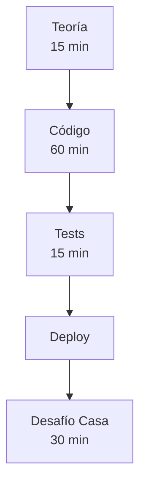

# 📚 Clase 5: Token Contract ERC-20-like

> **⚡ SEMANA 3: Aplicación Intensiva**  
> *"De Web2 Developer a Blockchain Builder en 90 minutos"*

## 🎯 Información General

- **📅 Fecha:** Martes 21/10/2025 - Semana 3
- **⏱️ Duración:** 90 minutos
- **👥 Nivel:** Intermedio
- **🔗 Proyecto:** Buen Día Builders
- **📍 Token funcionando:** [Token BdB ejemplo](https://github.com/mariaelisaaraya/token-bdb?tab=readme-ov-file)

## 📖 Estructura de la Clase

La clase está organizada en los siguientes documentos:

### 📄 Documentos Principales

1. **[01-resumen.md](./01-resumen.md)**
   - Visión general de la clase
   - Objetivos de aprendizaje
   - Pre-requisitos
   - Métricas de éxito

2. **[02-teoria-conceptual.md](./02-teoria-conceptual.md)**
   - ¿Qué es un token?
   - Estándar CAP-46
   - ERC-20 vs Stellar Tokens
   - Conceptos de seguridad

3. **[03-codigo-completo.md](./03-codigo-completo.md)**
   - Implementación completa del token
   - Estructura del proyecto
   - Explicación línea por línea
   - Decisiones de diseño

4. **[04-tests.md](./04-tests.md)**
   - Suite completa de tests
   - 25+ casos de prueba
   - Tests de edge cases
   - Patrones de testing

5. **[05-desafio-post-clase.md](./05-desafio-post-clase.md)**
   - Mini desafío para casa (30 min)
   - Ejercicios opcionales
   - Sistema de puntos

6. **[06-deployment.md](./06-deployment.md)**
   - Deploy paso a paso
   - Configuración de testnet
   - Scripts de automatización
   - Troubleshooting

7. **[07-proximos-pasos.md](./07-proximos-pasos.md)**
   - Preparación para Clase 6
   - Recursos adicionales
   - Plan de estudio
   - Comunidad

## 🎓 Flujo de Aprendizaje



## 💻 Código Quick Start

```bash
# Clonar el proyecto base que se encuentra en 3er-semana-aplicacion/5-Clase/03-codigo-completo.md, create una carpeta para token-bdb
Y busca el token BdB que esta en lib.rs

# Instalar dependencias y compilar
cargo build

# Correr tests
cargo test

# Build para deploy (genera WASM)
stellar contract build

# Deploy a testnet
stellar contract deploy \
    --wasm target/wasm32-none/release/token_bdb.wasm \
    --source alice \
    --network testnet
```

## 🏆 Lo que Construirás

Un token funcional con:
- ✅ Mint y Burn
- ✅ Transfer entre cuentas  
- ✅ Sistema de Allowances
- ✅ Metadatos (name, symbol, decimals)
- ✅ Tests completos
- ✅ Deploy en testnet

## 📊 Estructura del Token

```rust
pub trait TokenTrait {
    fn initialize(env: Env, admin: Address, name: String, symbol: String, decimals: u32);
    fn mint(env: Env, to: Address, amount: u128) -> Result<(), TokenError>;
    fn burn(env: Env, from: Address, amount: u128) -> Result<(), TokenError>;
    fn transfer(env: Env, from: Address, to: Address, amount: u128) -> Result<(), TokenError>;
    fn approve(env: Env, from: Address, spender: Address, amount: u128) -> Result<(), TokenError>;
    fn transfer_from(env: Env, spender: Address, from: Address, to: Address, amount: u128) -> Result<(), TokenError>;
    
    // Getters
    fn balance(env: Env, account: Address) -> u128;
    fn allowance(env: Env, from: Address, spender: Address) -> u128;
    fn name(env: Env) -> String;
    fn symbol(env: Env) -> String;
    fn decimals(env: Env) -> u32;
    fn total_supply(env: Env) -> u128;
}
```

## 🎯 Competencias a Desarrollar

### Technical Skills
- 🔧 Smart Contract Development
- 🔧 Rust for Blockchain
- 🔧 Token Standards (CAP-46)
- 🔧 Testing Strategies
- 🔧 Deployment Pipeline

### Soft Skills
- 💡 Problem Solving
- 💡 Security Mindset
- 💡 Attention to Detail
- 💡 Documentation

## 📚 Pre-requisitos

- ✅ Clases 1-4 completadas
- ✅ Rust básico dominado
- ✅ Soroban SDK instalado
- ✅ Cuenta en testnet

## 🛠️ Herramientas Necesarias

```bash
# Versiones mínimas
rustc 1.74.0+
stellar 20.0.0+
cargo 1.74.0+
```

## 📖 Durante la Clase

### ⏱️ Timeline

| Tiempo | Actividad | Descripción |
|--------|-----------|-------------|
| 0:00-0:15 | Teoría | Tokens, CAP-46, Seguridad |
| 0:15-0:30 | Setup | Crear proyecto, estructura |
| 0:30-0:50 | Core Functions | mint, transfer, burn |
| 0:50-0:70 | Allowances | approve, transferFrom |
| 0:70-0:80 | Tests | Escribir y ejecutar tests |
| 0:80-0:90 | Deploy | Subir a testnet |

### 🎯 Enfoque de la Clase

La clase se enfoca en:
1. **Aplicación práctica** de todo lo aprendido en Rust
2. **Código production-ready** desde el inicio
3. **Mejores prácticas** de seguridad
4. **Tests exhaustivos** como parte del desarrollo

## 🏠 Desafío Post-Clase (30 minutos)

Después de la clase, tienes un mini desafío:

**"Token Analytics"** - Agregar una función que retorne estadísticas:
- Total de holders (cuentas con balance > 0)
- Largest holder
- Average balance

Tiempo estimado: 30 minutos
Dificultad: ⭐⭐☆☆☆

Ver detalles completos en [05-desafio-post-clase.md](./05-desafio-post-clase.md)

## 🔗 Links Importantes

### Documentación
- [Stellar Token Standards](https://developers.stellar.org/docs/tokens)
- [Soroban Docs](https://soroban.stellar.org/docs)
- [CAP-46 Specification](https://stellar.org/protocol/cap-46)

### Herramientas
- [Stellar Laboratory](https://laboratory.stellar.org)
- [Testnet Explorer](https://stellar.expert/explorer/testnet)
- [Freighter Wallet](https://www.freighter.app/)

### Comunidad
- [Discord Stellar](https://discord.gg/stellar)
- Telegram de [Buen Día Builders](https://buendiabuilders.com)

## ❓ FAQs

**P: ¿Necesito experiencia previa con tokens?**
R: No, la clase cubre todo desde cero, pero sí necesitas haber completado las clases 3-4 de Rust.

**P: ¿Puedo usar otro nombre para mi token?**
R: ¡Por supuesto! El ejemplo usa "BDB" pero puedes personalizarlo.

**P: ¿Qué pasa si mi deploy falla?**
R: Revisa [06-deployment.md](./06-deployment.md) sección Troubleshooting.

**P: ¿El código es reusable para producción?**
R: Sí, el código sigue estándares de producción y mejores prácticas.

## 📈 Métricas de Éxito

- [ ] Token deployado en testnet
- [ ] 25+ tests pasando
- [ ] Operaciones básicas funcionando
- [ ] Comprensión del estándar CAP-46
- [ ] Código limpio y documentado

## 🚀 Próxima Clase

**Clase 6: Integración con Frontend**
- React + Stellar SDK
- Freighter Wallet integration
- UI para todas las operaciones
- Real-time updates

## 💬 Soporte

Si tienes dudas:
1. Revisa la documentación en este repo
2. Pregunta en el Discord de Stellar
3. Contacta en el grupo de Buen Día Builders

## 🙏 Contribuciones

¿Encontraste un error o tienes una mejora? 
- Abre un issue
- Envía un PR
- Comparte tu feedback

---

### 🦈 Mensaje de las Tiburonas Senior

> "Esta clase es donde todo click. Donde ves que Rust no es solo sintaxis rara, sino una herramienta poderosa para construir sistemas financieros seguros. 
> 
> Tómate tu tiempo, entiende cada línea, y no tengas miedo de experimentar. El mejor aprendizaje viene de romper cosas y arreglarlas.
> 
> ¡A nadar en las aguas profundas del blockchain! 🌊"

---

**Buen Día Builders** | [Web](https://buendiabuilders.com) | [Twitter](https://x.com/buendiabuilders) | [LinkedIn](https://linkedin.com/company/buen-dia-builders)

*Empowering developers, one smart contract at a time* 🚀
