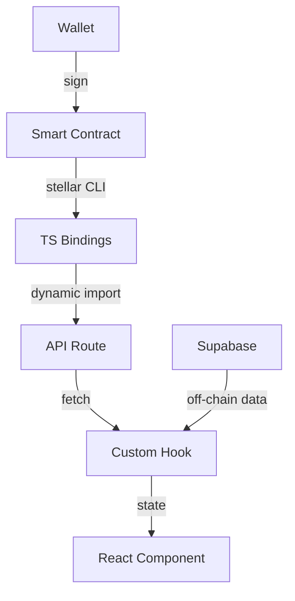

# 🦈 STELLAR DAPP - LA GUÍA COMPLETA TIBURONA

> **Para las clases de Buen Día Builders** 💜
> Versión 2.0 - La Definitiva

---

# 📚 TABLA DE CONTENIDOS

1. [**README - Overview del Proyecto**](#1-readme---overview-del-proyecto)
2. [**SETUP - Instalación y Configuración**](#2-setup---instalación-y-configuración)
3. [**CONEXIÓN - Arquitectura Contratos-Frontend**](#3-conexión---arquitectura-contratos-frontend)
4. [**NUEVOS CONTRATOS - Tutorial Paso a Paso**](#4-nuevos-contratos---tutorial-paso-a-paso)
5. [**OPTIMIZACIÓN - Performance y Mejores Prácticas**](#5-optimización---performance-y-mejores-prácticas)
6. [**TIPS & TRICKS - Secretos Tiburona**](#6-tips--tricks---secretos-tiburona)

---

# 1. README - OVERVIEW DEL PROYECTO

## 🚀 ¿QUÉ ES ESTO, TIBURONXS?

Este es un **TEMPLATE MONOREPO FULLSTACK** para construir dApps en Stellar. Es como tener un Ferrari listo para arrancar - ¡solo tenés que subirte y manejar!

### 🎯 **¿Para qué sirve?**
- Construir dApps completas en Stellar/Soroban
- Tener backend (Supabase) + frontend (Next.js) + smart contracts (Rust) todo integrado
- Empezar a codear sin perder tiempo en configuraciones

### 📦 **Estructura del Proyecto**

```
stellar-startup-template/
├── apps/
│   ├── backend/        # Supabase (PostgreSQL, Auth, Storage)
│   └── web/           # Next.js 16 + Stellar Wallets Kit
├── contracts/         # Smart Contracts en Rust
│   └── contracts/
│       ├── hello-world/
│       ├── increment/
│       ├── fungible-token/
│       ├── non-fungible-token/
│       └── starter/
└── packages/         # TypeScript bindings generados
```

### 🔥 **Stack Tecnológico**

- **Frontend**: Next.js 16, React 18, TypeScript, Tailwind CSS
- **Backend**: Supabase (PostgreSQL, Auth, Realtime, Storage)
- **Blockchain**: Stellar/Soroban, Rust Smart Contracts
- **Wallets**: Stellar Wallets Kit (Freighter, xBull, Albedo)
- **Tools**: Stellar CLI v23+, Docker, pnpm/npm

---

# 2. SETUP - INSTALACIÓN Y CONFIGURACIÓN

## 🛠️ REQUISITOS PREVIOS

### **Software Necesario:**

```bash
# 1. Node.js 20+ y npm
node --version  # Debe ser v20 o mayor

# 2. Docker Desktop (para Supabase local)
docker --version

# 3. Rust y Cargo
curl --proto '=https' --tlsv1.2 -sSf https://sh.rustup.rs | sh

# 4. Stellar CLI v23+
cargo install --locked stellar-cli --features opt

# 5. WASM target para Rust
rustup target add wasm32v1-none

# 6. Supabase CLI
brew install supabase/tap/supabase
# o con npm:
npm install -g supabase
```

## 🚀 INSTALACIÓN PASO A PASO

### **PASO 1: Clonar y Setup Inicial**

```bash
# Clonar el repo
git clone https://github.com/tu-repo/stellar-startup-template.git
cd stellar-startup-template

# Instalar dependencias
npm install  # o pnpm install
```

### **PASO 2: Backend (Supabase)**

```bash
# Entrar a la carpeta del backend
cd apps/backend

# Inicializar Supabase
npx supabase init

# IMPORTANTE: Docker debe estar corriendo!
# Levantar Supabase local
npm run dev

# En otra terminal, obtener credenciales
npm run status
```

**Guardar estos valores:**
```
API URL: http://localhost:54321
anon key: eyJhbGciOiJIUzI1NiIsInR5cCI6IkpXVCJ9...
service_role key: eyJhbGciOiJIUzI1NiIsInR5cCI6IkpXVCJ9...
```

### **PASO 3: Frontend (Next.js)**

```bash
# Ir a la carpeta web
cd apps/web

# Copiar archivo de configuración
cp .env.local.example .env.local

# Editar .env.local
code .env.local  # o nano .env.local
```

**Configurar variables de entorno:**
```env
# Supabase (usar valores del paso anterior)
NEXT_PUBLIC_SUPABASE_URL=http://localhost:54321
NEXT_PUBLIC_SUPABASE_ANON_KEY=eyJ...

# Stellar Network
NEXT_PUBLIC_STELLAR_NETWORK=testnet
NEXT_PUBLIC_STELLAR_HORIZON_URL=https://horizon-testnet.stellar.org
NEXT_PUBLIC_STELLAR_SOROBAN_RPC_URL=https://soroban-testnet.stellar.org

# App Config
NEXT_PUBLIC_APP_NAME=Mi dApp Tiburona
NEXT_PUBLIC_APP_URL=http://localhost:3000

# Contract Bindings (se llenan después)
HELLO_WORLD_BINDING=
NEXT_PUBLIC_INCREMENT_BINDING=
```

### **PASO 4: Levantar Frontend**

```bash
# Desde apps/web
npm run dev
```

✅ **Frontend corriendo en** http://localhost:3000

### **PASO 5: Cuenta Stellar Testnet**

```bash
# Generar keys
stellar keys generate my_account --network testnet

# Exportar para usar
export PUBLIC_KEY=GXXXXXX...
export SECRET_KEY=SXXXXXX...

# Fondear con Friendbot
curl "https://friendbot.stellar.org?addr=$PUBLIC_KEY"
```

---

# 3. CONEXIÓN - ARQUITECTURA CONTRATOS-FRONTEND

## 🎯 FLUJO DE DATOS

```
Smart Contract (Rust) → TypeScript Bindings → API Routes/Hooks → React Components
        ↓                       ↓                    ↓                ↓
    [Blockchain]          [Generated Code]      [Next.js]        [UI/UX]
```

## 📊 ARQUITECTURA COMPLETA



## 🔥 COMPONENTES CLAVE

### **1. Smart Contract (Rust)**

```rust
// contracts/contracts/hello-world/src/lib.rs
#![no_std]
use soroban_sdk::{contract, contractimpl, vec, Env, String, Vec};

#[contract]
pub struct Contract;

#[contractimpl]
impl Contract {
    pub fn hello(env: Env, to: String) -> Vec<String> {
        vec![&env, String::from_str(&env, "Hello"), to]
    }
}
```

### **2. TypeScript Bindings (Generado)**

```typescript
// packages/hello_world/src/index.ts (AUTO-GENERADO)
export class Client {
  async hello(args: {to: string}): Promise<Array<string>> {
    const tx = new Transaction(/* ... */);
    const result = await this.simulate(tx);
    return parseResult(result);
  }
}
```

### **3. API Route (Next.js)**

```typescript
// apps/web/app/api/hello-world/route.ts
async function getClient() {
  const moduleId = process.env.HELLO_WORLD_BINDING;
  const dynamicImport = (0, eval)("import");
  const Client = await dynamicImport(moduleId);
  return new Client.Client({ ...config });
}

export async function POST(req: NextRequest) {
  const { to } = await req.json();
  const client = await getClient();
  const { result } = await client.hello({ to });
  return Response.json({ greeting: result.join(" ") });
}
```

### **4. Custom Hook**

```typescript
// apps/web/hooks/useHelloWorld.ts
export function useHelloWorld() {
  const [loading, setLoading] = useState(false);
  const [greeting, setGreeting] = useState<string | null>(null);

  const sayHello = async (to: string) => {
    setLoading(true);
    const res = await fetch("/api/hello-world", {
      method: "POST",
      body: JSON.stringify({ to }),
    });
    const data = await res.json();
    setGreeting(data.greeting);
    setLoading(false);
  };

  return { sayHello, greeting, loading };
}
```

### **5. React Component**

```tsx
// apps/web/components/HelloWorld.tsx
export function HelloWorld() {
  const { sayHello, greeting, loading } = useHelloWorld();
  const [name, setName] = useState("Tiburona");

  return (
    <div>
      <input value={name} onChange={(e) => setName(e.target.value)} />
      <button onClick={() => sayHello(name)}>
        {loading ? "Loading..." : "Say Hello"}
      </button>
      {greeting && <p>{greeting}</p>}
    </div>
  );
}
```

---

# 4. NUEVOS CONTRATOS - TUTORIAL PASO A PASO

## 🎯 AGREGAR UN NUEVO CONTRATO COMPLETO

¡TIBURONA! Vamos a crear un contrato de **Votación** desde cero. Este ejemplo te enseña TODO el proceso.

### **PASO 1: Crear el Smart Contract**

```bash
# Crear carpeta del contrato
cd contracts/contracts
mkdir voting
cd voting

# Inicializar Cargo
cargo init --lib --name voting
```

**Editar `Cargo.toml`:**
```toml
[package]
name = "voting"
version = "0.1.0"
edition = "2021"

[lib]
crate-type = ["cdylib"]

[dependencies]
soroban-sdk = { workspace = true }

[dev-dependencies]
soroban-sdk = { workspace = true, features = ["testutils"] }
```

**Crear el contrato `src/lib.rs`:**
```rust
#![no_std]
use soroban_sdk::{
    contract, contractimpl, contracttype, 
    symbol_short, vec, Env, Symbol, Address, Vec, Map
};

// Estructura para guardar propuestas
#[derive(Clone)]
#[contracttype]
pub struct Proposal {
    pub id: u32,
    pub title: String,
    pub votes: u32,
    pub creator: Address,
}

// Keys para storage
#[derive(Clone)]
#[contracttype]
pub enum DataKey {
    ProposalCount,
    Proposal(u32),
    HasVoted(Address, u32),
}

#[contract]
pub struct VotingContract;

#[contractimpl]
impl VotingContract {
    // Inicializar el contrato
    pub fn initialize(env: Env) -> Symbol {
        env.storage().instance().set(&DataKey::ProposalCount, &0u32);
        symbol_short!("OK")
    }
    
    // Crear una nueva propuesta
    pub fn create_proposal(
        env: Env, 
        creator: Address, 
        title: String
    ) -> u32 {
        creator.require_auth();
        
        // Obtener el contador actual
        let mut count: u32 = env
            .storage()
            .instance()
            .get(&DataKey::ProposalCount)
            .unwrap_or(0);
        
        // Crear la propuesta
        let proposal = Proposal {
            id: count,
            title: title.clone(),
            votes: 0,
            creator: creator.clone(),
        };
        
        // Guardar la propuesta
        env.storage()
            .persistent()
            .set(&DataKey::Proposal(count), &proposal);
        
        // Incrementar contador
        count += 1;
        env.storage()
            .instance()
            .set(&DataKey::ProposalCount, &count);
        
        // Emitir evento
        env.events().publish(
            (symbol_short!("proposal"), creator),
            proposal.id
        );
        
        proposal.id
    }
    
    // Votar por una propuesta
    pub fn vote(env: Env, voter: Address, proposal_id: u32) -> u32 {
        voter.require_auth();
        
        // Verificar si ya votó
        let voted_key = DataKey::HasVoted(voter.clone(), proposal_id);
        if env.storage().persistent().has(&voted_key) {
            panic!("Already voted!");
        }
        
        // Obtener la propuesta
        let proposal_key = DataKey::Proposal(proposal_id);
        let mut proposal: Proposal = env
            .storage()
            .persistent()
            .get(&proposal_key)
            .expect("Proposal not found");
        
        // Incrementar votos
        proposal.votes += 1;
        
        // Guardar cambios
        env.storage()
            .persistent()
            .set(&proposal_key, &proposal);
        
        // Marcar que ya votó
        env.storage()
            .persistent()
            .set(&voted_key, &true);
        
        // Emitir evento
        env.events().publish(
            (symbol_short!("vote"), voter),
            proposal_id
        );
        
        proposal.votes
    }
    
    // Obtener una propuesta
    pub fn get_proposal(env: Env, proposal_id: u32) -> Proposal {
        env.storage()
            .persistent()
            .get(&DataKey::Proposal(proposal_id))
            .expect("Proposal not found")
    }
    
    // Obtener todas las propuestas
    pub fn get_all_proposals(env: Env) -> Vec<Proposal> {
        let count: u32 = env
            .storage()
            .instance()
            .get(&DataKey::ProposalCount)
            .unwrap_or(0);
        
        let mut proposals = vec![&env];
        
        for i in 0..count {
            if let Some(proposal) = env
                .storage()
                .persistent()
                .get(&DataKey::Proposal(i)) 
            {
                proposals.push_back(proposal);
            }
        }
        
        proposals
    }
}

#[cfg(test)]
mod test {
    use super::*;
    use soroban_sdk::{testutils::Address as _, String, Address, Env};

    #[test]
    fn test_voting() {
        let env = Env::default();
        let contract_id = env.register(VotingContract, ());
        let client = VotingContractClient::new(&env, &contract_id);
        
        // Initialize
        client.initialize();
        
        // Create proposal
        let creator = Address::generate(&env);
        let title = String::from_str(&env, "Proposal 1");
        
        env.mock_all_auths();
        let id = client.create_proposal(&creator, &title);
        assert_eq!(id, 0);
        
        // Vote
        let voter = Address::generate(&env);
        let votes = client.vote(&voter, &id);
        assert_eq!(votes, 1);
        
        // Get proposal
        let proposal = client.get_proposal(&id);
        assert_eq!(proposal.votes, 1);
    }
}
```

### **PASO 2: Compilar y Testear**

```bash
# Compilar
stellar contract build

# Testear
cargo test

# Optimizar (opcional para producción)
stellar contract optimize --wasm target/wasm32v1-none/release/voting.wasm
```

### **PASO 3: Deploy a Testnet**

```bash
# Deploy
CONTRACT_ID=$(stellar contract deploy \
  --wasm target/wasm32v1-none/release/voting.wasm \
  --network testnet \
  --source $SECRET_KEY)

echo "Contract deployed: $CONTRACT_ID"

# Inicializar
stellar contract invoke \
  --id $CONTRACT_ID \
  --network testnet \
  --source $SECRET_KEY \
  -- \
  initialize
```

### **PASO 4: Generar TypeScript Bindings**

```bash
# Desde la raíz del proyecto
stellar contract bindings typescript \
  --network testnet \
  --contract-id $CONTRACT_ID \
  --output-dir packages/voting

# Compilar el paquete
cd packages/voting
npm install
npm run build
cd ../..
```

### **PASO 5: Crear API Route**

```typescript
// apps/web/app/api/voting/route.ts
import { NextRequest } from "next/server";

async function getVotingClient() {
  const moduleId = process.env.VOTING_BINDING || process.env.NEXT_PUBLIC_VOTING_BINDING;
  
  if (!moduleId) {
    throw new Error("VOTING_BINDING not configured");
  }
  
  const dynamicImport = (0, eval)("import");
  const Module = await dynamicImport(moduleId);
  const networks = Module.networks ?? {};
  const config = networks.testnet ?? {};
  
  return new Module.Client({
    ...config,
    rpcUrl: process.env.NEXT_PUBLIC_STELLAR_SOROBAN_RPC_URL
  });
}

// GET todas las propuestas
export async function GET() {
  try {
    const client = await getVotingClient();
    const { result } = await client.get_all_proposals();
    
    return Response.json({
      ok: true,
      proposals: result
    });
  } catch (error) {
    return Response.json({
      ok: false,
      error: error.message
    }, { status: 500 });
  }
}

// POST crear propuesta
export async function POST(req: NextRequest) {
  const { creator, title } = await req.json();
  
  try {
    const client = await getVotingClient();
    const { result } = await client.create_proposal({
      creator,
      title
    });
    
    return Response.json({
      ok: true,
      proposalId: result
    });
  } catch (error) {
    return Response.json({
      ok: false,
      error: error.message
    }, { status: 500 });
  }
}
```

### **PASO 6: Crear Custom Hook**

```typescript
// apps/web/hooks/useVoting.ts
import { useState, useCallback, useEffect } from "react";
import { useWalletsKitContext } from "@/contexts/WalletsKitContext";

interface Proposal {
  id: number;
  title: string;
  votes: number;
  creator: string;
}

export function useVoting() {
  const { address, signTransaction, refreshAddress } = useWalletsKitContext();
  const [proposals, setProposals] = useState<Proposal[]>([]);
  const [loading, setLoading] = useState(false);
  const [error, setError] = useState<string | null>(null);

  // Cargar client del contrato
  const loadClient = async () => {
    const moduleId = process.env.NEXT_PUBLIC_VOTING_BINDING;
    if (!moduleId) throw new Error("VOTING_BINDING not set");
    
    const dynamicImport = (0, eval)("import");
    const Module = await dynamicImport(moduleId);
    return new Module.Client({
      ...Module.networks.testnet,
      rpcUrl: process.env.NEXT_PUBLIC_STELLAR_SOROBAN_RPC_URL
    });
  };

  // Obtener todas las propuestas
  const fetchProposals = useCallback(async () => {
    setLoading(true);
    try {
      const res = await fetch("/api/voting");
      const data = await res.json();
      
      if (!data.ok) throw new Error(data.error);
      
      setProposals(data.proposals);
      setError(null);
    } catch (err) {
      setError(err.message);
    } finally {
      setLoading(false);
    }
  }, []);

  // Crear nueva propuesta
  const createProposal = useCallback(async (title: string) => {
    if (!address) throw new Error("Connect wallet first");
    
    setLoading(true);
    try {
      const client = await loadClient();
      
      // Configurar client con wallet
      client.options = client.options || {};
      client.options.publicKey = address;
      client.options.signTransaction = signTransaction;
      
      // Crear propuesta
      const tx = await client.create_proposal({
        creator: address,
        title
      });
      
      const { result } = await tx.signAndSend();
      
      // Recargar propuestas
      await fetchProposals();
      
      return result;
    } catch (err) {
      setError(err.message);
      throw err;
    } finally {
      setLoading(false);
    }
  }, [address, signTransaction, fetchProposals]);

  // Votar por una propuesta
  const vote = useCallback(async (proposalId: number) => {
    if (!address) throw new Error("Connect wallet first");
    
    setLoading(true);
    try {
      const client = await loadClient();
      
      // Configurar client
      client.options = client.options || {};
      client.options.publicKey = address;
      client.options.signTransaction = signTransaction;
      
      // Votar
      const tx = await client.vote({
        voter: address,
        proposal_id: proposalId
      });
      
      const { result } = await tx.signAndSend();
      
      // Recargar propuestas
      await fetchProposals();
      
      return result;
    } catch (err) {
      if (err.message.includes("Already voted")) {
        setError("Ya votaste por esta propuesta!");
      } else {
        setError(err.message);
      }
      throw err;
    } finally {
      setLoading(false);
    }
  }, [address, signTransaction, fetchProposals]);

  // Cargar propuestas al montar
  useEffect(() => {
    fetchProposals();
  }, [fetchProposals]);

  return {
    proposals,
    loading,
    error,
    createProposal,
    vote,
    refresh: fetchProposals
  };
}
```

### **PASO 7: Crear Componente React**

```tsx
// apps/web/components/Voting.tsx
"use client";
import { useState } from "react";
import { useVoting } from "@/hooks/useVoting";
import { useWalletsKitContext } from "@/contexts/WalletsKitContext";
import { Button } from "@/components/ui/button";

export function Voting() {
  const { address, openModalAndConnect } = useWalletsKitContext();
  const { proposals, loading, error, createProposal, vote } = useVoting();
  const [newTitle, setNewTitle] = useState("");
  const [creating, setCreating] = useState(false);

  const handleCreate = async () => {
    if (!newTitle.trim()) return;
    
    setCreating(true);
    try {
      await createProposal(newTitle);
      setNewTitle("");
      alert("Propuesta creada!");
    } catch (err) {
      console.error(err);
    } finally {
      setCreating(false);
    }
  };

  const handleVote = async (proposalId: number) => {
    try {
      await vote(proposalId);
      alert("Voto registrado!");
    } catch (err) {
      if (err.message.includes("Already voted")) {
        alert("Ya votaste por esta propuesta!");
      } else {
        console.error(err);
      }
    }
  };

  if (!address) {
    return (
      <div className="text-center py-8">
        <h2 className="text-2xl font-bold mb-4">Sistema de Votación</h2>
        <Button onClick={openModalAndConnect}>
          Conectar Wallet para Votar
        </Button>
      </div>
    );
  }

  return (
    <div className="max-w-4xl mx-auto p-6">
      <h2 className="text-3xl font-bold mb-6 bg-gradient-to-r from-indigo-600 to-fuchsia-500 bg-clip-text text-transparent">
        Sistema de Votación Blockchain
      </h2>

      {/* Crear nueva propuesta */}
      <div className="mb-8 p-4 border rounded-lg bg-white/70 backdrop-blur">
        <h3 className="text-xl font-semibold mb-3">Crear Nueva Propuesta</h3>
        <div className="flex gap-2">
          <input
            type="text"
            value={newTitle}
            onChange={(e) => setNewTitle(e.target.value)}
            placeholder="Título de la propuesta..."
            className="flex-1 px-4 py-2 border rounded-md"
            disabled={creating}
          />
          <Button
            onClick={handleCreate}
            disabled={creating || !newTitle.trim()}
          >
            {creating ? "Creando..." : "Crear"}
          </Button>
        </div>
      </div>

      {/* Lista de propuestas */}
      <div className="space-y-4">
        <h3 className="text-xl font-semibold">Propuestas Activas</h3>
        
        {loading && <p>Cargando propuestas...</p>}
        {error && <p className="text-red-600">Error: {error}</p>}
        
        {proposals.length === 0 && !loading && (
          <p className="text-gray-500">No hay propuestas todavía. ¡Creá la primera!</p>
        )}
        
        {proposals.map((proposal) => (
          <div
            key={proposal.id}
            className="p-4 border rounded-lg bg-white/70 backdrop-blur hover:shadow-lg transition-shadow"
          >
            <div className="flex justify-between items-center">
              <div>
                <h4 className="text-lg font-medium">{proposal.title}</h4>
                <p className="text-sm text-gray-600">
                  Votos: <span className="font-bold">{proposal.votes}</span>
                </p>
                <p className="text-xs text-gray-500">
                  Creado por: {proposal.creator.slice(0, 8)}...
                </p>
              </div>
              <Button
                onClick={() => handleVote(proposal.id)}
                variant="outline"
                disabled={loading}
              >
                Votar
              </Button>
            </div>
          </div>
        ))}
      </div>
    </div>
  );
}
```

### **PASO 8: Integrar en la App**

```tsx
// apps/web/app/voting/page.tsx
import { Voting } from "@/components/Voting";

export default function VotingPage() {
  return (
    <main className="container mx-auto py-8">
      <Voting />
    </main>
  );
}
```

**Actualizar `.env.local`:**
```env
NEXT_PUBLIC_VOTING_BINDING=packages/voting
```

**Actualizar navegación:**
```tsx
// apps/web/components/Navbar.tsx
<a href="/voting" className="...">Votación</a>
```

---

# 5. OPTIMIZACIÓN - PERFORMANCE Y MEJORES PRÁCTICAS

## 🚀 OPTIMIZACIÓN DE LLAMADAS RPC

### **1. Batching de Llamadas**

En lugar de hacer múltiples llamadas individuales, agrupá las operaciones:

```typescript
// ❌ MALO - Múltiples llamadas
const balance1 = await client.get_balance({ address: addr1 });
const balance2 = await client.get_balance({ address: addr2 });
const balance3 = await client.get_balance({ address: addr3 });

// ✅ BUENO - Una sola llamada
const balances = await client.get_multiple_balances({ 
  addresses: [addr1, addr2, addr3] 
});
```

### **2. Implementar Caché**

```typescript
// apps/web/hooks/useContractCache.ts
import { useState, useCallback, useRef } from "react";

interface CacheEntry<T> {
  data: T;
  timestamp: number;
  ttl: number; // Time to live en ms
}

export function useContractCache<T>() {
  const cache = useRef<Map<string, CacheEntry<T>>>(new Map());

  const getCached = useCallback((key: string): T | null => {
    const entry = cache.current.get(key);
    
    if (!entry) return null;
    
    const now = Date.now();
    if (now > entry.timestamp + entry.ttl) {
      cache.current.delete(key);
      return null;
    }
    
    return entry.data;
  }, []);

  const setCached = useCallback((
    key: string, 
    data: T, 
    ttl: number = 60000 // 1 minuto por defecto
  ) => {
    cache.current.set(key, {
      data,
      timestamp: Date.now(),
      ttl
    });
  }, []);

  const clearCache = useCallback(() => {
    cache.current.clear();
  }, []);

  return { getCached, setCached, clearCache };
}

// Usar en tu hook
export function useOptimizedContract() {
  const { getCached, setCached } = useContractCache();
  
  const getData = async (id: string) => {
    // Verificar caché primero
    const cached = getCached(id);
    if (cached) return cached;
    
    // Si no está en caché, buscar
    const data = await fetchFromContract(id);
    
    // Guardar en caché
    setCached(id, data, 30000); // 30 segundos
    
    return data;
  };
}
```

### **3. Debouncing para Inputs**

```typescript
// apps/web/hooks/useDebounce.ts
import { useState, useEffect } from "react";

export function useDebounce<T>(value: T, delay: number = 500): T {
  const [debouncedValue, setDebouncedValue] = useState<T>(value);

  useEffect(() => {
    const handler = setTimeout(() => {
      setDebouncedValue(value);
    }, delay);

    return () => clearTimeout(handler);
  }, [value, delay]);

  return debouncedValue;
}

// Usar en componente
export function SearchComponent() {
  const [search, setSearch] = useState("");
  const debouncedSearch = useDebounce(search, 300);
  
  useEffect(() => {
    if (debouncedSearch) {
      // Solo buscar cuando el usuario deje de tipear
      searchContract(debouncedSearch);
    }
  }, [debouncedSearch]);
}
```

### **4. Optimistic Updates**

Actualizar la UI inmediatamente, sin esperar la confirmación:

```typescript
// apps/web/hooks/useOptimisticVoting.ts
export function useOptimisticVoting() {
  const [proposals, setProposals] = useState<Proposal[]>([]);
  const [optimisticUpdates, setOptimisticUpdates] = useState<Map<number, number>>(new Map());

  const vote = async (proposalId: number) => {
    // 1. Actualización optimista inmediata
    setOptimisticUpdates(prev => {
      const newMap = new Map(prev);
      const currentVotes = newMap.get(proposalId) || 0;
      newMap.set(proposalId, currentVotes + 1);
      return newMap;
    });

    try {
      // 2. Llamada real al contrato
      await contractVote(proposalId);
      
      // 3. Actualizar con datos reales
      const updatedProposals = await fetchProposals();
      setProposals(updatedProposals);
      
      // 4. Limpiar actualización optimista
      setOptimisticUpdates(prev => {
        const newMap = new Map(prev);
        newMap.delete(proposalId);
        return newMap;
      });
    } catch (error) {
      // 5. Revertir si falla
      setOptimisticUpdates(prev => {
        const newMap = new Map(prev);
        newMap.delete(proposalId);
        return newMap;
      });
      throw error;
    }
  };

  // Combinar datos reales con optimistas
  const displayProposals = proposals.map(p => ({
    ...p,
    votes: p.votes + (optimisticUpdates.get(p.id) || 0)
  }));

  return { displayProposals, vote };
}
```

### **5. Lazy Loading de Contratos**

```typescript
// apps/web/hooks/useLazyContract.ts
import { lazy, Suspense } from "react";

// Lazy load de componentes pesados
const HeavyContract = lazy(() => import("@/components/HeavyContract"));

export function LazyContractLoader() {
  return (
    <Suspense fallback={<div>Cargando contrato...</div>}>
      <HeavyContract />
    </Suspense>
  );
}

// Lazy load de bindings
export function useLazyBinding() {
  const [client, setClient] = useState(null);
  
  const loadClient = useCallback(async () => {
    if (client) return client; // Ya cargado
    
    const module = await import("packages/heavy_contract");
    const newClient = new module.Client(config);
    setClient(newClient);
    return newClient;
  }, [client]);
  
  return { loadClient };
}
```

### **6. Pagination para Listas Grandes**

```typescript
// apps/web/hooks/usePaginatedData.ts
export function usePaginatedData(pageSize: number = 10) {
  const [data, setData] = useState([]);
  const [currentPage, setCurrentPage] = useState(1);
  const [totalPages, setTotalPages] = useState(0);
  const [loading, setLoading] = useState(false);

  const fetchPage = async (page: number) => {
    setLoading(true);
    try {
      const start = (page - 1) * pageSize;
      const end = start + pageSize;
      
      // Llamada al contrato con límites
      const result = await contract.get_data_range({
        start,
        limit: pageSize
      });
      
      setData(result.items);
      setTotalPages(Math.ceil(result.total / pageSize));
      setCurrentPage(page);
    } finally {
      setLoading(false);
    }
  };

  return {
    data,
    currentPage,
    totalPages,
    loading,
    nextPage: () => fetchPage(currentPage + 1),
    prevPage: () => fetchPage(currentPage - 1),
    goToPage: fetchPage
  };
}
```

### **7. Web Workers para Operaciones Pesadas**

```typescript
// apps/web/workers/crypto.worker.ts
self.addEventListener("message", async (event) => {
  const { type, payload } = event.data;
  
  switch (type) {
    case "SIGN_TRANSACTION":
      // Operación pesada en background
      const signed = await heavySigningOperation(payload);
      self.postMessage({ type: "SIGNED", payload: signed });
      break;
  }
});

// apps/web/hooks/useWorker.ts
export function useCryptoWorker() {
  const workerRef = useRef<Worker>();
  
  useEffect(() => {
    workerRef.current = new Worker(
      new URL("../workers/crypto.worker.ts", import.meta.url)
    );
    
    workerRef.current.onmessage = (event) => {
      // Manejar respuestas
    };
    
    return () => workerRef.current?.terminate();
  }, []);
  
  const signWithWorker = (data: any) => {
    workerRef.current?.postMessage({
      type: "SIGN_TRANSACTION",
      payload: data
    });
  };
  
  return { signWithWorker };
}
```

### **8. Connection Pooling para RPC**

```typescript
// apps/web/lib/rpc-pool.ts
class RPCConnectionPool {
  private connections: Map<string, any> = new Map();
  private maxConnections = 5;
  
  async getConnection(url: string) {
    // Reusar conexión existente
    if (this.connections.has(url)) {
      return this.connections.get(url);
    }
    
    // Crear nueva si hay espacio
    if (this.connections.size < this.maxConnections) {
      const conn = await this.createConnection(url);
      this.connections.set(url, conn);
      return conn;
    }
    
    // Esperar por conexión disponible
    return this.waitForConnection(url);
  }
  
  private async createConnection(url: string) {
    // Crear conexión RPC
    return new SorobanRpc.Server(url);
  }
  
  private async waitForConnection(url: string) {
    // Implementar cola de espera
  }
}

export const rpcPool = new RPCConnectionPool();
```

### **9. Optimización de Bundle Size**

```typescript
// next.config.ts
import { BundleAnalyzerPlugin } from "webpack-bundle-analyzer";

const nextConfig = {
  webpack: (config, { isServer }) => {
    // Solo importar lo necesario de stellar-sdk
    config.resolve.alias = {
      ...config.resolve.alias,
      "@stellar/stellar-sdk": "@stellar/stellar-sdk/lib/index.min.js"
    };
    
    // Tree shaking agresivo
    config.optimization = {
      ...config.optimization,
      usedExports: true,
      sideEffects: false
    };
    
    // Analyzer en dev
    if (process.env.ANALYZE === "true") {
      config.plugins.push(
        new BundleAnalyzerPlugin({
          analyzerMode: "static",
          openAnalyzer: false
        })
      );
    }
    
    return config;
  }
};
```

### **10. Monitoring y Métricas**

```typescript
// apps/web/lib/monitoring.ts
class PerformanceMonitor {
  private metrics: Map<string, number[]> = new Map();
  
  startTimer(label: string): () => void {
    const start = performance.now();
    
    return () => {
      const duration = performance.now() - start;
      this.recordMetric(label, duration);
    };
  }
  
  recordMetric(label: string, value: number) {
    if (!this.metrics.has(label)) {
      this.metrics.set(label, []);
    }
    
    const values = this.metrics.get(label)!;
    values.push(value);
    
    // Mantener solo últimos 100 valores
    if (values.length > 100) {
      values.shift();
    }
    
    // Log si es muy lento
    if (value > 1000) {
      console.warn(`Operación lenta detectada: ${label} tomó ${value}ms`);
    }
  }
  
  getStats(label: string) {
    const values = this.metrics.get(label) || [];
    
    if (values.length === 0) return null;
    
    const sum = values.reduce((a, b) => a + b, 0);
    const avg = sum / values.length;
    const max = Math.max(...values);
    const min = Math.min(...values);
    
    return { avg, max, min, count: values.length };
  }
}

export const monitor = new PerformanceMonitor();

// Usar en hooks
export function useMonitoredContract() {
  const callContract = async () => {
    const endTimer = monitor.startTimer("contract_call");
    
    try {
      const result = await contract.method();
      return result;
    } finally {
      endTimer();
    }
  };
}
```

---

# 6. TIPS & TRICKS - SECRETOS TIBURONA

## 🦈 TIPS DE DESARROLLO

### **1. Estructura de Carpetas Escalable**

```
apps/web/
├── components/
│   ├── ui/           # Componentes reutilizables
│   ├── features/     # Componentes por feature
│   └── layouts/      # Layouts
├── hooks/
│   ├── contracts/    # Hooks de contratos
│   ├── ui/          # Hooks de UI
│   └── utils/       # Hooks utilitarios
├── lib/
│   ├── contracts/   # Lógica de contratos
│   ├── utils/       # Utilidades
│   └── constants/   # Constantes
└── contexts/        # Contexts globales
```

### **2. Testing de Contratos**

```typescript
// apps/web/__tests__/contracts/voting.test.ts
import { renderHook, act, waitFor } from "@testing-library/react";
import { useVoting } from "@/hooks/useVoting";

// Mock del wallet context
jest.mock("@/contexts/WalletsKitContext", () => ({
  useWalletsKitContext: () => ({
    address: "GTEST...",
    signTransaction: jest.fn()
  })
}));

describe("Voting Contract", () => {
  it("should create proposal", async () => {
    const { result } = renderHook(() => useVoting());
    
    await act(async () => {
      await result.current.createProposal("Test Proposal");
    });
    
    await waitFor(() => {
      expect(result.current.proposals).toHaveLength(1);
    });
  });
});
```

### **3. Environment Variables Best Practices**

```typescript
// apps/web/lib/env.ts
const requiredEnvVars = [
  "NEXT_PUBLIC_SUPABASE_URL",
  "NEXT_PUBLIC_SUPABASE_ANON_KEY",
  "NEXT_PUBLIC_STELLAR_NETWORK"
] as const;

// Validar en build time
requiredEnvVars.forEach(varName => {
  if (!process.env[varName]) {
    throw new Error(`Missing required env var: ${varName}`);
  }
});

// Type-safe env vars
export const env = {
  supabase: {
    url: process.env.NEXT_PUBLIC_SUPABASE_URL!,
    anonKey: process.env.NEXT_PUBLIC_SUPABASE_ANON_KEY!
  },
  stellar: {
    network: process.env.NEXT_PUBLIC_STELLAR_NETWORK as "testnet" | "mainnet",
    horizonUrl: process.env.NEXT_PUBLIC_STELLAR_HORIZON_URL!,
    rpcUrl: process.env.NEXT_PUBLIC_STELLAR_SOROBAN_RPC_URL!
  }
};
```

### **4. Error Boundaries**

```tsx
// apps/web/components/ErrorBoundary.tsx
import { Component, ReactNode } from "react";

interface Props {
  children: ReactNode;
  fallback?: ReactNode;
}

interface State {
  hasError: boolean;
  error?: Error;
}

export class ErrorBoundary extends Component<Props, State> {
  constructor(props: Props) {
    super(props);
    this.state = { hasError: false };
  }

  static getDerivedStateFromError(error: Error): State {
    return { hasError: true, error };
  }

  componentDidCatch(error: Error, errorInfo: any) {
    console.error("Error caught by boundary:", error, errorInfo);
    
    // Enviar a servicio de monitoring
    if (typeof window !== "undefined") {
      // Sentry, LogRocket, etc
    }
  }

  render() {
    if (this.state.hasError) {
      return this.props.fallback || (
        <div className="p-4 border border-red-500 rounded">
          <h2 className="text-red-600 font-bold">Algo salió mal</h2>
          <p className="text-gray-600">{this.state.error?.message}</p>
          <button
            onClick={() => this.setState({ hasError: false })}
            className="mt-2 px-4 py-2 bg-blue-500 text-white rounded"
          >
            Reintentar
          </button>
        </div>
      );
    }

    return this.props.children;
  }
}
```

### **5. Custom Logging**

```typescript
// apps/web/lib/logger.ts
enum LogLevel {
  DEBUG = 0,
  INFO = 1,
  WARN = 2,
  ERROR = 3
}

class Logger {
  private level: LogLevel = LogLevel.INFO;
  private isDev = process.env.NODE_ENV === "development";

  debug(...args: any[]) {
    if (this.level <= LogLevel.DEBUG) {
      console.log("[DEBUG]", ...args);
    }
  }

  info(...args: any[]) {
    if (this.level <= LogLevel.INFO) {
      console.info("[INFO]", ...args);
    }
  }

  warn(...args: any[]) {
    if (this.level <= LogLevel.WARN) {
      console.warn("[WARN]", ...args);
    }
  }

  error(...args: any[]) {
    console.error("[ERROR]", ...args);
    
    // En producción, enviar a servicio
    if (!this.isDev) {
      // Enviar a Sentry, etc
    }
  }

  time(label: string) {
    if (this.isDev) {
      console.time(label);
    }
  }

  timeEnd(label: string) {
    if (this.isDev) {
      console.timeEnd(label);
    }
  }
}

export const logger = new Logger();
```

### **6. Comandos Útiles Alias**

```json
// package.json
{
  "scripts": {
    "dev:all": "concurrently \"npm run dev:backend\" \"npm run dev:web\"",
    "dev:backend": "cd apps/backend && npm run dev",
    "dev:web": "cd apps/web && npm run dev",
    "build:contracts": "cd contracts && for d in contracts/*; do (cd \"$d\" && stellar contract build); done",
    "test:all": "npm run test:contracts && npm run test:web",
    "test:contracts": "cd contracts && cargo test",
    "test:web": "cd apps/web && npm test",
    "deploy:contract": "node scripts/deploy-contract.js",
    "generate:bindings": "node scripts/generate-bindings.js",
    "check:env": "node scripts/check-env.js"
  }
}
```

### **7. Git Hooks con Husky**

```json
// .husky/pre-commit
#!/bin/sh
. "$(dirname "$0")/_/husky.sh"

# Formatear código
npm run format

# Lint
npm run lint

# Tests
npm run test:all
```

### **8. Docker Compose para Development**

```yaml
# docker-compose.yml
version: '3.8'

services:
  supabase:
    image: supabase/supabase
    ports:
      - "54321:54321"
    environment:
      - POSTGRES_PASSWORD=postgres
    volumes:
      - supabase_data:/var/lib/postgresql/data

  stellar:
    image: stellar/quickstart
    ports:
      - "8000:8000"
    command: --testnet
    
  redis:
    image: redis:alpine
    ports:
      - "6379:6379"

volumes:
  supabase_data:
```

### **9. Debugging Avanzado**

```typescript
// apps/web/lib/debug.ts
export const debug = {
  // Log con stack trace
  trace: (message: string, ...args: any[]) => {
    console.group(`🔍 ${message}`);
    console.log(...args);
    console.trace();
    console.groupEnd();
  },

  // Log de performance
  perf: async <T>(
    label: string, 
    fn: () => Promise<T>
  ): Promise<T> => {
    const start = performance.now();
    
    try {
      const result = await fn();
      const duration = performance.now() - start;
      
      console.log(
        `⚡ ${label}: ${duration.toFixed(2)}ms`
      );
      
      return result;
    } catch (error) {
      const duration = performance.now() - start;
      console.error(
        `❌ ${label} failed after ${duration.toFixed(2)}ms`,
        error
      );
      throw error;
    }
  },

  // Log de contratos
  contract: (method: string, args: any, result: any) => {
    console.group(`📜 Contract: ${method}`);
    console.log("Args:", args);
    console.log("Result:", result);
    console.groupEnd();
  }
};
```

### **10. Secretos de Producción**

```typescript
// apps/web/lib/production.ts

// 1. Rate limiting
export class RateLimiter {
  private attempts = new Map<string, number[]>();
  
  canMakeRequest(
    key: string, 
    maxAttempts: number = 10, 
    windowMs: number = 60000
  ): boolean {
    const now = Date.now();
    const attempts = this.attempts.get(key) || [];
    
    // Filtrar intentos viejos
    const recent = attempts.filter(
      t => now - t < windowMs
    );
    
    if (recent.length >= maxAttempts) {
      return false;
    }
    
    recent.push(now);
    this.attempts.set(key, recent);
    
    return true;
  }
}

// 2. Retry con exponential backoff
export async function retryWithBackoff<T>(
  fn: () => Promise<T>,
  maxRetries: number = 3,
  baseDelay: number = 1000
): Promise<T> {
  let lastError: Error;
  
  for (let i = 0; i < maxRetries; i++) {
    try {
      return await fn();
    } catch (error) {
      lastError = error as Error;
      
      if (i < maxRetries - 1) {
        const delay = baseDelay * Math.pow(2, i);
        await new Promise(r => setTimeout(r, delay));
      }
    }
  }
  
  throw lastError!;
}

// 3. Circuit breaker
export class CircuitBreaker {
  private failures = 0;
  private lastFailTime = 0;
  private state: "closed" | "open" | "half-open" = "closed";
  
  constructor(
    private threshold: number = 5,
    private timeout: number = 60000
  ) {}
  
  async execute<T>(fn: () => Promise<T>): Promise<T> {
    if (this.state === "open") {
      if (Date.now() - this.lastFailTime > this.timeout) {
        this.state = "half-open";
      } else {
        throw new Error("Circuit breaker is open");
      }
    }
    
    try {
      const result = await fn();
      
      if (this.state === "half-open") {
        this.state = "closed";
        this.failures = 0;
      }
      
      return result;
    } catch (error) {
      this.failures++;
      this.lastFailTime = Date.now();
      
      if (this.failures >= this.threshold) {
        this.state = "open";
      }
      
      throw error;
    }
  }
}
```

---

## 🎓 RECURSOS Y REFERENCIAS

### **Documentación Oficial**
- [Stellar Developers](https://developers.stellar.org)
- [Soroban Docs](https://soroban.stellar.org)
- [Supabase Docs](https://supabase.com/docs)
- [Next.js Docs](https://nextjs.org/docs)

### **Tutoriales Recomendados**
- [Build a Dapp Frontend](https://developers.stellar.org/docs/build/apps/dapp-frontend)
- [Smart Contract Examples](https://github.com/stellar/soroban-examples)
- [Stellar Quest](https://quest.stellar.org)

### **Herramientas Útiles**
- [Stellar Laboratory](https://laboratory.stellar.org)
- [Stellar Expert Explorer](https://stellar.expert)
- [Freighter Wallet](https://www.freighter.app)

### **Comunidad**
- [Stellar Discord](https://discord.gg/stellar)
- [Stellar Developers Google Group](https://groups.google.com/g/stellar-dev)
- [Stack Exchange](https://stellarstack.exchange)

---

## 🚢 DEPLOYMENT CHECKLIST

### **Antes de ir a Producción:**

- [ ] Todos los tests pasan
- [ ] Contratos auditados
- [ ] Variables de entorno configuradas
- [ ] Rate limiting implementado
- [ ] Error handling robusto
- [ ] Monitoring configurado
- [ ] Backups automáticos
- [ ] SSL/TLS configurado
- [ ] WAF configurado
- [ ] Logs centralizados
- [ ] Alertas configuradas
- [ ] Documentación actualizada
- [ ] Plan de rollback
- [ ] Load testing realizado
- [ ] Security testing completado

---

## 🎉 CONCLUSIÓN

¡FELICITACIONES TIBURONA! 🦈

Ahora tenés TODO lo necesario para:
- ✅ Entender la arquitectura completa
- ✅ Crear nuevos contratos desde cero
- ✅ Optimizar performance
- ✅ Implementar mejores prácticas
- ✅ Deployar a producción

**PRÓXIMOS PASOS:**
1. Practicá con el contrato de votación
2. Creá tu propio contrato custom
3. Optimizá las llamadas RPC
4. Implementá caché y pagination
5. ¡Deployá tu dApp!

---

**¡DALE TIBURONA, A CONSTRUIR EL FUTURO EN STELLAR!** 🚀🦈💜

*Creado con amor para las clases de Buen Día Builders*
*Versión 2.0 - Diciembre 2024*

---

## 📝 NOTAS FINALES

**¿Preguntas?** No dudes en consultar en:
- Discord de Stellar
- Foro de desarrolladores
- GitHub issues

**¿Encontraste un bug?** Abrí un issue en GitHub

**¿Querés contribuir?** ¡Los PRs son bienvenidos!

---

*Keep building, keep shipping, keep learning!* 🦈✨


