# 🦈 STELLAR DAPP - GUÍA ULTRA COMENTADA PARA BUEN DÍA BUILDERS

> **Versión 3.0 - ULTRA COMENTADA** 💜
> Con explicaciones detalladas en cada línea de código


### 📦 **Estructura del Proyecto**

```bash
stellar-startup-template/
├── apps/                      # Aplicaciones del monorepo
│   ├── backend/              # Backend con Supabase
│   │   ├── supabase/        # Configuración de Supabase
│   │   ├── migrations/      # Migraciones SQL
│   │   └── types/          # TypeScript types generados
│   └── web/                # Frontend con Next.js
│       ├── app/           # App Router de Next.js 14+
│       ├── components/    # Componentes React
│       ├── hooks/        # Custom hooks
│       ├── contexts/     # React contexts
│       └── lib/         # Utilidades y helpers
├── contracts/          # Smart Contracts en Rust
│   └── contracts/     # Cada subcarpeta es un contrato
│       ├── hello-world/       # Contrato ejemplo básico
│       ├── increment/        # Counter con storage
│       ├── fungible-token/  # Token ERC20-like
│       └── voting/          # Sistema de votación (lo creamos)
└── packages/                # Paquetes compartidos
    └── [bindings]/         # TypeScript bindings generados
```

---

# 2. SETUP - INSTALACIÓN Y CONFIGURACIÓN

## 🛠️ REQUISITOS PREVIOS CON EXPLICACIÓN

```bash
# ¿Por qué cada herramienta?

# 1. Node.js 20+ y npm
# NECESARIO PARA: Ejecutar JavaScript/TypeScript en el servidor
# Next.js, Supabase CLI, y todas las dependencias lo requieren
node --version  # Debe ser v20 o mayor

# 2. Docker Desktop 
# NECESARIO PARA: Correr Supabase localmente SI LO USAS LOCAL
# Supabase usa contenedores para PostgreSQL, Auth, Storage, etc.
docker --version

# 3. Rust y Cargo
# NECESARIO PARA: Compilar smart contracts a WASM
# Los contratos de Stellar se escriben en Rust
curl --proto '=https' --tlsv1.2 -sSf https://sh.rustup.rs | sh

# 4. Stellar CLI v23+
# NECESARIO PARA: Compilar, deployar e interactuar con contratos
# Es la herramienta oficial de Stellar para desarrollo
cargo install --locked stellar-cli --features opt

# 5. WASM target para Rust
# NECESARIO PARA: Compilar Rust a WebAssembly
# Los contratos se ejecutan como WASM en Stellar
rustup target add wasm32v1-none

# 6. Supabase CLI
# NECESARIO PARA: Manejar el backend local
# Gestiona la base de datos, auth y storage
brew install supabase/tap/supabase
```

---

# 3. CONEXIÓN - ARQUITECTURA CONTRATOS-FRONTEND ULTRA COMENTADA

## 🎯 FLUJO DE DATOS EXPLICADO

```mermaid
graph LR
    A[1. Smart Contract<br/>Rust] -->|stellar CLI genera| B[2. TypeScript Bindings<br/>Auto-generado]
    B -->|import dinámico| C[3. API Route<br/>Next.js Backend]
    C -->|HTTP fetch| D[4. Custom Hook<br/>React State]
    D -->|props y state| E[5. Component<br/>UI React]
    F[6. Wallet<br/>Freighter/xBull] -->|firma txs| A
    G[7. Supabase<br/>PostgreSQL] -->|datos off-chain| D
```



## 🔥 COMPONENTES CLAVE ULTRA COMENTADOS

### **1. SMART CONTRACT (RUST) - SÚPER COMENTADO**

```rust
// 📁 contracts/contracts/hello-world/src/lib.rs

// #![no_std] le dice a Rust que NO use la librería estándar
// Esto es CRUCIAL porque:
// 1. Reduce el tamaño del WASM generado (de ~1MB a ~10KB)
// 2. La std library tiene funciones que no existen en blockchain
// 3. Soroban provee sus propias alternativas optimizadas
#![no_std]

// Importamos todo lo necesario del SDK de Soroban
// Cada import tiene un propósito específico:
use soroban_sdk::{
    contract,      // Macro para marcar structs como contratos
    contractimpl,  // Macro para implementar métodos públicos
    vec,          // Vector optimizado para blockchain
    Env,          // Ambiente de ejecución (como 'window' en browser)
    String,       // String optimizado (no es std::string::String)
    Vec,          // Vector type-safe para returns
};

// #[contract] es una MACRO PROCEDURAL que:
// 1. Genera código boilerplate para el contrato
// 2. Registra la struct como entry point
// 3. Prepara la serialización/deserialización
// 4. Genera los exports de WASM necesarios
#[contract]
pub struct Contract;  // El nombre puede ser cualquiera

// #[contractimpl] es FUNDAMENTAL porque:
// 1. Convierte métodos en endpoints llamables
// 2. Genera el ABI (Application Binary Interface)
// 3. Maneja la codificación de parámetros
// 4. Gestiona los returns automáticamente
#[contractimpl]
impl Contract {
    // TODA función pública se vuelve un endpoint del contrato
    // Reglas importantes:
    // - SIEMPRE el primer parámetro es 'env: Env'
    // - Los parámetros deben ser tipos que Soroban entienda
    // - El return debe ser serializable
    pub fn hello(
        env: Env,        // Contexto blockchain (storage, events, etc.)
        to: String       // Parámetro del usuario
    ) -> Vec<String> {   // Return type DEBE ser explícito
        
        // vec! es una macro de Soroban (NO de Rust std)
        // El &env es necesario para que el vec sepa en qué
        // contexto de blockchain está operando
        vec![
            &env,                               // Contexto
            String::from_str(&env, "Hello"),   // Literal convertido
            to                                  // Parámetro recibido
        ]
    }
}

// Los tests en Rust van en el mismo archivo
// #[cfg(test)] significa "solo compilar en modo test"
#[cfg(test)]
mod test {
    use super::*;
    use soroban_sdk::{testutils::Address as _, Env};

    #[test]
    fn test_hello() {
        // Env::default() crea un blockchain simulado en memoria
        let env = Env::default();
        
        // Registra el contrato y obtiene su ID
        let contract_id = env.register(Contract, ());
        
        // Cliente autogenerado por las macros
        let client = ContractClient::new(&env, &contract_id);
        
        // Llamada al método como si fuera deployed
        let result = client.hello(&String::from_str(&env, "World"));
        
        // Verificación
        assert_eq!(
            result,
            vec![
                &env,
                String::from_str(&env, "Hello"),
                String::from_str(&env, "World"),
            ]
        );
    }
}
```

### **2. API ROUTE (NEXT.JS) - MEGA COMENTADO**

```typescript
// 📁 apps/web/app/api/hello-world/route.ts

// NextRequest es el tipo de Next.js para requests HTTP
// Extiende el Request nativo con funcionalidades extra
import { NextRequest } from "next/server";

// getConfig centraliza TODAS las variables de entorno
// Esto evita typos y provee type safety
import { getConfig } from "@/lib/config";

// Tipo para el body del request - SIEMPRE tipar!
type HelloRequest = { 
  to?: string  // opcional con ?
};

/**
 * getClient - Carga el cliente del contrato DINÁMICAMENTE
 * 
 * ¿Por qué dinámicamente?
 * 1. Los bindings se generan DESPUÉS del build
 * 2. Permite cambiar contratos sin recompilar
 * 3. Soporta múltiples contratos con la misma lógica
 * 4. Evita circular dependencies
 */
async function getClient() {
  // Obtener configuración centralizada
  const cfg = getConfig();
  
  // Buscar el path del binding en variables de entorno
  // Primero intenta sin NEXT_PUBLIC_ (server-side)
  // Luego con NEXT_PUBLIC_ (client-side)
  const moduleId = 
    process.env.HELLO_WORLD_BINDING || 
    process.env.NEXT_PUBLIC_HELLO_WORLD_BINDING;
  
  // VALIDACIÓN TEMPRANA - Fail fast!
  if (!moduleId) {
    throw new Error(
      "HELLO_WORLD_BINDING no está configurado. " +
      "Generá los bindings con: stellar contract bindings typescript ... " +
      "Y configurá la variable en .env.local"
    );
  }
  
  try {
    // 🔥 TRUCO IMPORTANTE: Dynamic Import Hack
    // Next.js no permite dynamic imports normales en edge runtime
    // Este hack usa eval para bypasear la restricción
    // (0, eval) crea un indirect eval que ejecuta en global scope
    const dynamicImport: (s: string) => Promise<any> = (0, eval)("import");
    
    // Importar el módulo generado
    const Client = await dynamicImport(moduleId as string);
    
    // Los bindings generados incluyen configuración de red
    // Estructura esperada:
    // {
    //   Client: class,
    //   networks: {
    //     testnet: { contractId: "C...", networkPassphrase: "..." },
    //     mainnet: { ... }
    //   }
    // }
    const networks = (Client as any).networks ?? {};
    
    // Obtener config para testnet (o la red configurada)
    const base = networks?.testnet ?? {};
    
    // IMPORTANTE: Sobrescribir rpcUrl con el nuestro
    // El generado puede estar desactualizado o ser incorrecto
    const client = new (Client as any).Client({ 
      ...base,                    // Config del binding
      rpcUrl: cfg.sorobanRpcUrl   // OVERRIDE con nuestro RPC
    });
    
    return client;
  } catch (e) {
    // Error descriptivo para debugging
    throw new Error(
      `Binding no encontrado en: ${String(moduleId)}. ` +
      `Verificá que: ` +
      `1. Generaste los bindings con stellar contract bindings typescript ` +
      `2. Compilaste el paquete con npm run build ` +
      `3. El path en .env.local es correcto. ` +
      `Error original: ${(e as Error).message}`
    );
  }
}

/**
 * GET Handler - Para requests GET
 * Ejemplo: /api/hello-world?to=Mundo
 */
export async function GET(req: NextRequest) {
  // Parsear query params de la URL
  const url = new URL(req.url);
  
  // Obtener el parámetro 'to' con default 'Devs!'
  const to = url.searchParams.get("to") ?? "Devs!";
  
  try {
    // Obtener cliente del contrato
    const client = await getClient();
    
    // 🔥 LLAMADA AL CONTRATO
    // client.hello() hace internamente:
    // 1. Construye la transacción
    // 2. La simula en el RPC (no gasta gas)
    // 3. Parsea el resultado
    // 4. Retorna el valor deserializado
    const { result } = await client.hello({ to });
    
    // Retornar JSON exitoso
    // result puede ser array o string según el contrato
    return Response.json({ 
      ok: true, 
      greeting: Array.isArray(result) 
        ? result.join(" ")  // Unir array en string
        : result            // Ya es string
    });
    
  } catch (e) {
    // Manejo de errores con status HTTP apropiado
    // 501 = Not Implemented (binding no encontrado)
    // 500 = Internal Server Error (otro error)
    return Response.json(
      { 
        ok: false, 
        error: (e as Error).message 
      }, 
      { 
        status: 501  // Not Implemented
      }
    );
  }
}

/**
 * POST Handler - Para requests POST con body
 * Ejemplo: POST /api/hello-world
 * Body: { "to": "Mundo" }
 */
export async function POST(req: NextRequest) {
  // Parsear JSON del body con manejo de errores
  // Si falla el parse, usa objeto vacío {}
  const body = (await req.json().catch(() => ({}))) as HelloRequest;
  
  // Extraer 'to' con default
  const to = body.to ?? "Devs!";
  
  try {
    const client = await getClient();
    
    // Misma llamada que en GET
    const { result } = await client.hello({ to });
    
    return Response.json({ 
      ok: true, 
      greeting: Array.isArray(result) 
        ? result.join(" ") 
        : result 
    });
    
  } catch (e) {
    return Response.json(
      { 
        ok: false, 
        error: (e as Error).message 
      }, 
      { 
        status: 501 
      }
    );
  }
}
```

### **3. CUSTOM HOOK - ULTRA DETALLADO**

```typescript
// 📁 apps/web/hooks/useHelloWorld.ts

"use client";  // Directiva de Next.js - este código corre en browser

import { useCallback, useState } from "react";

/**
 * useHelloWorld - Hook personalizado para interactuar con el contrato
 * 
 * Patrón de diseño:
 * 1. Encapsula toda la lógica de comunicación
 * 2. Maneja estados de loading y error
 * 3. Expone una API simple al componente
 * 4. Es reutilizable en múltiples componentes
 */
export function useHelloWorld() {
  // ========== ESTADO LOCAL ==========
  // Cada estado tiene un propósito específico:
  
  // loading: boolean - Indica si hay una operación en curso
  // Usado para: deshabilitar botones, mostrar spinners
  const [loading, setLoading] = useState(false);
  
  // error: string | null - Guarda el último error (null = sin error)
  // Usado para: mostrar mensajes de error al usuario
  const [error, setError] = useState<string | null>(null);
  
  // greeting: string | null - Resultado de la última llamada
  // Usado para: mostrar el saludo retornado por el contrato
  const [greeting, setGreeting] = useState<string | null>(null);

  /**
   * sayHello - Función para llamar al contrato
   * 
   * useCallback memoriza la función para evitar re-renders
   * El array vacío [] significa que nunca se recrea
   * 
   * @param to - A quién saludar
   * @returns Promise con el greeting o null si falla
   */
  const sayHello = useCallback(async (to: string) => {
    // Inicio de operación: actualizar estados
    setLoading(true);      // Activar indicador de carga
    setError(null);        // Limpiar errores anteriores
    
    try {
      // ========== LLAMADA AL BACKEND ==========
      // Usamos fetch nativo (no axios) por simplicidad
      const res = await fetch("/api/hello-world", {
        method: "POST",                              // Método HTTP
        headers: { 
          "Content-Type": "application/json"        // Indicar JSON
        },
        body: JSON.stringify({ to }),               // Serializar datos
      });
      
      // Parsear respuesta JSON
      const data = await res.json();
      
      // ========== VALIDACIÓN DE RESPUESTA ==========
      // Verificar AMBOS: status HTTP y flag 'ok' en data
      if (!res.ok || !data.ok) {
        // Si algo falló, lanzar error con mensaje descriptivo
        throw new Error(
          data.error ||                    // Error del backend
          `HTTP ${res.status}`             // O código HTTP
        );
      }
      
      // ========== ÉXITO: ACTUALIZAR ESTADO ==========
      setGreeting(data.greeting as string);
      
      // Retornar el resultado para uso en componente
      return data.greeting as string;
      
    } catch (e) {
      // ========== MANEJO DE ERRORES ==========
      // Capturar CUALQUIER error (network, parsing, etc.)
      
      const msg = (e as Error).message;
      
      // Actualizar estado de error
      setError(msg);
      
      // Limpiar greeting anterior (importante!)
      setGreeting(null);
      
      // Retornar null indica falla
      return null;
      
    } finally {
      // ========== CLEANUP ==========
      // finally SIEMPRE se ejecuta (éxito o error)
      // Perfecto para limpiar loading state
      setLoading(false);
    }
  }, []);  // [] = sin dependencias = función estable

  // ========== RETORNO DEL HOOK ==========
  // Exponer todo lo que el componente necesita
  // Orden: funciones primero, luego estados
  return { 
    sayHello,    // Función para ejecutar
    greeting,    // Resultado
    loading,     // Estado de carga
    error        // Mensaje de error
  };
}
```

### **4. HOOK CON WALLET - SÚPER EXPLICADO**

```typescript
// 📁 apps/web/hooks/useIncrement.ts

"use client";
import { useCallback, useState } from "react";
import { getConfig } from "@/lib/config";
import { useWalletsKitContext } from "@/contexts/WalletsKitContext";

/**
 * loadIncrementClient - Carga el cliente del contrato INCREMENT
 * 
 * Diferencias con el API route:
 * 1. Corre en el BROWSER (no en servidor)
 * 2. Usa NEXT_PUBLIC_ env vars (expuestas al cliente)
 * 3. No puede acceder a secrets del servidor
 * 
 * @param rpcUrl - URL del RPC de Soroban
 */
async function loadIncrementClient(rpcUrl: string) {
  // NEXT_PUBLIC_ hace la variable visible en browser
  // Sin este prefijo, sería undefined en cliente
  const moduleId = process.env.NEXT_PUBLIC_INCREMENT_BINDING;
  
  // Validación con mensaje claro para debugging
  if (!moduleId) {
    throw new Error(
      "NEXT_PUBLIC_INCREMENT_BINDING no está configurado. " +
      "Necesitás: " +
      "1. Generar bindings: stellar contract bindings typescript ... " +
      "2. Agregar a .env.local: NEXT_PUBLIC_INCREMENT_BINDING=packages/increment " +
      "3. Reiniciar Next.js"
    );
  }
  
  // Mismo truco de dynamic import que en el API route
  const dynamicImport: (s: string) => Promise<any> = (0, eval)("import");
  
  // Importar y configurar el módulo
  const mod: any = await dynamicImport(moduleId as string);
  const networks = mod.networks ?? {};
  const base = networks?.testnet ?? {};
  
  // Crear instancia con configuración
  const client = new mod.Client({ 
    ...base,     // Config del binding
    rpcUrl       // RPC override
  });
  
  return client;
}

/**
 * useIncrement - Hook para contrato que MODIFICA estado
 * 
 * Diferencias con useHelloWorld:
 * 1. REQUIERE wallet conectada (para firmar)
 * 2. MODIFICA estado en blockchain (no solo lee)
 * 3. GASTA gas (necesita fondos)
 * 4. Transacción debe ser FIRMADA por usuario
 */
export function useIncrement() {
  // Configuración global de la app
  const cfg = getConfig();
  
  // ========== WALLET CONTEXT ==========
  // Estos vienen del WalletsKitContext:
  const { 
    signTransaction,    // Función para firmar (abre popup en wallet)
    refreshAddress      // Obtener/refrescar address actual
  } = useWalletsKitContext();
  
  // Estados locales (igual que useHelloWorld)
  const [loading, setLoading] = useState(false);
  const [error, setError] = useState<string | null>(null);

  /**
   * increment - Incrementa el contador en el contrato
   * 
   * Flujo completo:
   * 1. Verificar wallet conectada
   * 2. Cargar cliente del contrato
   * 3. Configurar signing
   * 4. Construir transacción
   * 5. Simular (verify que funciona)
   * 6. Pedir firma al usuario
   * 7. Enviar transacción firmada
   * 8. Esperar confirmación
   */
  const increment = useCallback(async () => {
    setLoading(true);
    setError(null);
    
    try {
      // ========== PASO 1: CARGAR CLIENTE ==========
      const client: any = await loadIncrementClient(cfg.sorobanRpcUrl);
      
      // ========== PASO 2: VERIFICAR WALLET ==========
      // refreshAddress() intenta obtener la address actual
      // Si no hay wallet, retorna null
      const publicKey = await refreshAddress();
      
      // Validación crítica: sin wallet no se puede firmar
      if (!publicKey) {
        throw new Error(
          "¡Conectá una wallet primero! " +
          "Hacé click en 'Connect Wallet' en la navbar"
        );
      }
      
      // ========== PASO 3: CONFIGURAR SIGNING ==========
      // El cliente necesita saber:
      // 1. QUIÉN firma (publicKey)
      // 2. CÓMO firmar (signTransaction function)
      
      // Asegurar que options existe
      client.options = client.options || {};
      
      // Inyectar credenciales de signing
      client.options.publicKey = publicKey;           // Quién firma
      client.options.signTransaction = signTransaction; // Cómo firmar
      
      // ========== PASO 4: BUILD & SIMULATE ==========
      // client.increment() hace MUCHO internamente:
      // 1. Construye la transacción XDR
      // 2. La simula en el RPC (verifica que funcione)
      // 3. Calcula el fee exacto
      // 4. Prepara todo para signing
      const tx = await client.increment();
      
      // ========== PASO 5: SIGN & SEND ==========
      // tx.signAndSend() hace:
      // 1. Llama a signTransaction (abre popup en wallet)
      // 2. Usuario ve los detalles y aprueba/rechaza
      // 3. Si aprueba, firma la tx
      // 4. Envía la tx firmada al RPC
      // 5. Espera confirmación (1-5 segundos)
      // 6. Retorna el resultado
      const { result } = await tx.signAndSend();
      
      // result contiene el nuevo valor del contador
      return result as unknown;
      
    } catch (e) {
      // ========== MANEJO DE ERRORES ESPECÍFICOS ==========
      const msg = (e as Error).message;
      
      // Detectar errores comunes y dar mensajes útiles
      if (msg.includes("User declined")) {
        setError("Cancelaste la transacción");
      } else if (msg.includes("Insufficient balance")) {
        setError("Sin fondos suficientes para el fee");
      } else if (msg.includes("Network")) {
        setError("Error de red - verificá tu conexión");
      } else {
        setError(msg);
      }
      
      return null;
      
    } finally {
      setLoading(false);
    }
  }, [cfg.sorobanRpcUrl, refreshAddress, signTransaction]);
  // ☝️ Dependencias: se recrea si cambian

  // Retornar interface simple
  return { 
    loading, 
    error, 
    increment 
  };
}
```

### **5. WALLET CONTEXT - EXPLICACIÓN COMPLETA**

```typescript
// 📁 apps/web/contexts/WalletsKitContext.tsx

"use client";

import { 
  createContext, 
  useCallback, 
  useContext, 
  useEffect, 
  useMemo, 
  useRef, 
  useState, 
  type ReactNode 
} from "react";

// Stellar Wallets Kit - Librería que maneja múltiples wallets
import {
  StellarWalletsKit,      // Clase principal
  WalletNetwork,          // Enum: TESTNET | PUBLIC
  allowAllModules,        // Habilita todas las wallets disponibles
  XBULL_ID,              // ID de xBull wallet (default)
} from "@creit.tech/stellar-wallets-kit";

// Tipo para el contexto - Define qué expone
export type WalletsKitContextValue = {
  kit: StellarWalletsKit | null;              // Instancia del kit
  address: string | null;                     // Address conectada (G...)
  selectedWalletId: string | null;            // ID de wallet seleccionada
  network: WalletNetwork;                     // Red actual
  openModalAndConnect: () => Promise<void>;   // Abrir modal de wallets
  setWallet: (walletId: string) => Promise<void>;  // Cambiar wallet
  refreshAddress: () => Promise<string | null>;    // Obtener address
  signTransaction: (                               // Firmar transacción
    xdr: string,                                   // Transaction XDR
    opts?: {                                       // Opciones
      address?: string;
      networkPassphrase?: WalletNetwork | string;
    }
  ) => Promise<string>;                           // XDR firmado
  disconnect: () => void;                         // Desconectar
};

// Crear el contexto (undefined inicial)
const WalletsKitContext = createContext<WalletsKitContextValue | undefined>(
  undefined
);

/**
 * mapNetwork - Convierte string a enum WalletNetwork
 * 
 * @param env - String de environment (testnet/public/mainnet)
 * @returns WalletNetwork enum
 */
function mapNetwork(env: string | undefined): WalletNetwork {
  if (!env) return WalletNetwork.TESTNET;  // Default a testnet
  
  const v = env.toLowerCase();
  
  // Mapear variaciones comunes
  if (v === "public" || v === "mainnet") {
    return WalletNetwork.PUBLIC;
  }
  
  return WalletNetwork.TESTNET;
}

/**
 * WalletsKitProvider - Provee contexto de wallets a toda la app
 * 
 * Features:
 * 1. Auto-reconexión al recargar
 * 2. Persistencia en localStorage
 * 3. Soporte para múltiples wallets
 * 4. Manejo de errores robusto
 */
export function WalletsKitProvider({ children }: { children: ReactNode }) {
  // ========== CONFIGURACIÓN ==========
  const cfg = getConfig();
  const network = useMemo(
    () => mapNetwork(cfg.stellarNetwork), 
    [cfg.stellarNetwork]
  );
  
  // ========== REFERENCIAS Y ESTADO ==========
  
  // useRef para mantener la misma instancia entre renders
  // Evita recrear el kit en cada render
  const kitRef = useRef<StellarWalletsKit | null>(null);
  
  // Estados que causan re-render cuando cambian
  const [address, setAddress] = useState<string | null>(null);
  const [selectedWalletId, setSelectedWalletId] = useState<string | null>(null);

  // ========== LAZY INITIALIZATION ==========
  // Solo crear el kit una vez, cuando se necesite
  const kit = useMemo(() => {
    // Guard: no ejecutar en servidor (SSR)
    if (typeof window === "undefined") return null;
    
    // Si ya existe, reusar
    if (!kitRef.current) {
      // Crear nueva instancia
      kitRef.current = new StellarWalletsKit({
        network,                        // Red (testnet/mainnet)
        selectedWalletId: XBULL_ID,     // Wallet default
        modules: allowAllModules(),     // Habilitar todas las wallets
        // Otras opciones:
        // - modalTheme: "light" | "dark"
        // - modalTitle: "Connect Wallet"
      });
    }
    
    return kitRef.current;
  }, [network]);  // Recrear si cambia la red

  // ========== FUNCIÓN: SETEAR WALLET ==========
  const setWallet = useCallback(async (walletId: string) => {
    if (!kit) return;
    
    // Cambiar wallet activa en el kit
    await kit.setWallet(walletId);
    
    // Actualizar estado local
    setSelectedWalletId(walletId);
    
    // ========== PERSISTENCIA ==========
    // Guardar en localStorage para reconectar
    try {
      if (typeof window !== "undefined") {
        localStorage.setItem("stellar.wallet.selected", walletId);
      }
    } catch (_e) {
      // localStorage puede fallar en modo incógnito
      console.warn("No se pudo guardar wallet en localStorage");
    }
  }, [kit]);

  // ========== FUNCIÓN: OBTENER ADDRESS ==========
  const refreshAddress = useCallback(async () => {
    if (!kit) return null;
    
    try {
      // Pedir address a la wallet
      // Puede abrir popup si necesita permisos
      const { address: addr } = await kit.getAddress();
      
      // Actualizar estado
      setAddress(addr);
      
      // Persistir
      try {
        if (typeof window !== "undefined") {
          localStorage.setItem("stellar.wallet.address", addr);
        }
      } catch (_e) {
        // Ignorar errores de storage
      }
      
      return addr;
      
    } catch (_e) {
      // Error = no hay wallet o usuario rechazó
      setAddress(null);
      
      // Limpiar storage
      try {
        if (typeof window !== "undefined") {
          localStorage.removeItem("stellar.wallet.address");
        }
      } catch (_e) {
        // Ignorar
      }
      
      return null;
    }
  }, [kit]);

  // ========== FUNCIÓN: ABRIR MODAL ==========
  const openModalAndConnect = useCallback(async () => {
    if (!kit) return;
    
    // Abrir modal con todas las wallets disponibles
    await kit.openModal({
      // Callback cuando usuario selecciona una wallet
      onWalletSelected: async (option: ISupportedWallet) => {
        // option tiene: { id, name, icon, ... }
        
        // Cambiar a esa wallet
        await setWallet(option.id);
        
        // Obtener address inmediatamente
        await refreshAddress();
      },
      // Otras opciones:
      // onClosed: () => console.log("Modal cerrado"),
      // modalTitle: "Elegí tu wallet",
    });
  }, [kit, refreshAddress, setWallet]);

  // ========== FUNCIÓN: FIRMAR TRANSACCIÓN ==========
  const signTransaction = useCallback(
    async (
      xdr: string,  // Transaction en formato XDR (base64)
      opts?: { 
        address?: string; 
        networkPassphrase?: WalletNetwork | string;
      }
    ) => {
      if (!kit) {
        throw new Error("Wallet kit no inicializado");
      }
      
      // Determinar qué address usar
      const addr = 
        opts?.address ??              // 1. Parámetro explícito
        address ??                     // 2. Address actual
        (await refreshAddress());      // 3. Obtener nueva
      
      if (!addr) {
        throw new Error(
          "No hay wallet conectada. " +
          "Conectá una wallet primero."
        );
      }
      
      // Network passphrase identifica la red
      const networkPassphrase = opts?.networkPassphrase ?? network;
      
      // ========== LLAMAR A LA WALLET ==========
      // Esto abre un popup en la wallet donde el usuario:
      // 1. Ve los detalles de la transacción
      // 2. Puede aprobar o rechazar
      // 3. Si aprueba, firma con su clave privada
      const { signedTxXdr } = await kit.signTransaction(xdr, {
        address: addr,
        networkPassphrase,
        // Otras opciones posibles:
        // - memo: "Pago de factura #123"
        // - submitUrl: "https://api.stellar.org"
      });
      
      // Retornar XDR firmado (listo para enviar)
      return signedTxXdr;
    },
    [kit, address, network, refreshAddress]
  );

  // ========== AUTO-RECONEXIÓN AL MONTAR ==========
  useEffect(() => {
    if (!kit) return;
    
    try {
      // Buscar última wallet usada
      const lastWallet = 
        typeof window !== "undefined" 
          ? localStorage.getItem("stellar.wallet.selected") 
          : null;
      
      if (lastWallet) {
        // Reconectar automáticamente
        (async () => {
          // Setear wallet
          await setWallet(lastWallet);
          
          // Recuperar address guardada (optimización)
          const storedAddr = localStorage.getItem("stellar.wallet.address");
          if (storedAddr) {
            setAddress(storedAddr);
          }
          
          // Refrescar address (verificar que sigue válida)
          await refreshAddress();
        })();
      }
    } catch (_e) {
      console.warn("No se pudo reconectar wallet");
    }
  }, [kit, setWallet, refreshAddress]);
  // Solo ejecutar una vez al montar

  // ========== FUNCIÓN: DESCONECTAR ==========
  const disconnect = useCallback(() => {
    // Limpiar estados
    setAddress(null);
    setSelectedWalletId(null);
    
    // Limpiar localStorage
    try {
      if (typeof window !== "undefined") {
        localStorage.removeItem("stellar.wallet.selected");
        localStorage.removeItem("stellar.wallet.address");
      }
    } catch (_e) {
      // Ignorar errores
    }
  }, []);

  // ========== CREAR OBJETO DE CONTEXTO ==========
  const value: WalletsKitContextValue = {
    kit,
    address,
    selectedWalletId,
    network,
    openModalAndConnect,
    setWallet,
    refreshAddress,
    signTransaction,
    disconnect,
  };

  // ========== PROVEER CONTEXTO ==========
  return (
    <WalletsKitContext.Provider value={value}>
      {children}
    </WalletsKitContext.Provider>
  );
}

/**
 * useWalletsKitContext - Hook para usar el contexto
 * 
 * Throw error si se usa fuera del provider
 * Esto ayuda a detectar errores de setup temprano
 */
export function useWalletsKitContext(): WalletsKitContextValue {
  const ctx = useContext(WalletsKitContext);
  
  if (!ctx) {
    throw new Error(
      "useWalletsKitContext debe usarse dentro de WalletsKitProvider. " +
      "Verificá que tu componente esté wrapped en <WalletsKitProvider>..."
    );
  }
  
  return ctx;
}
```

---

# 4. NUEVOS CONTRATOS - TUTORIAL PASO A PASO ULTRA COMENTADO

## 🎯 CREAR UN SISTEMA DE VOTACIÓN COMPLETO

### **PASO 1: Smart Contract en Rust - SÚPER COMENTADO**

```rust
// 📁 contracts/contracts/voting/src/lib.rs

// Desactivar librería estándar para optimización WASM
#![no_std]

// Imports del SDK de Soroban
use soroban_sdk::{
    contract,       // Macro para definir contratos
    contractimpl,   // Macro para implementar métodos
    contracttype,   // Macro para tipos serializables
    symbol_short,   // Crear símbolos cortos (hasta 9 chars)
    vec,           // Vector optimizado
    Env,           // Ambiente de ejecución
    Symbol,        // Tipo Symbol para eventos
    Address,       // Direcciones de Stellar (G...)
    Vec,           // Tipo Vector para returns
    Map            // HashMap optimizado para blockchain
};

// ========== TIPOS DE DATOS ==========

// #[contracttype] hace que el struct sea:
// 1. Serializable para guardar en storage
// 2. Deserializable para leer de storage
// 3. Optimizado para blockchain (usa XDR)
#[derive(Clone)]  // Clone es necesario para contracttype
#[contracttype]
pub struct Proposal {
    pub id: u32,              // ID único incremental
    pub title: String,        // Título de la propuesta
    pub votes: u32,          // Contador de votos
    pub creator: Address,    // Quién la creó (para auditoría)
    // Podríamos agregar más campos:
    // pub created_at: u64,  // Timestamp
    // pub description: String,
    // pub status: ProposalStatus,
}

// DataKey define las "llaves" para el storage
// Como keys en una base de datos
#[derive(Clone)]
#[contracttype]
pub enum DataKey {
    // Contador global de propuestas
    ProposalCount,
    
    // Propuesta específica por ID
    // Proposal(0), Proposal(1), etc.
    Proposal(u32),
    
    // Registro de votos: ¿Address X votó por propuesta Y?
    // HasVoted(GUSER..., 0) = true/false
    HasVoted(Address, u32),
    
    // Podríamos agregar más:
    // VoterCount,           // Total de votantes
    // AdminList,           // Lista de admins
    // ProposalsByCreator(Address),
}

// ========== CONTRATO ==========

#[contract]
pub struct VotingContract;

#[contractimpl]
impl VotingContract {
    // ========== INICIALIZACIÓN ==========
    /// Inicializa el contrato con valores por defecto
    /// DEBE llamarse una sola vez después del deploy
    pub fn initialize(env: Env) -> Symbol {
        // Verificar que no esté inicializado
        // (podríamos agregar este check)
        // if env.storage().instance().has(&DataKey::ProposalCount) {
        //     panic!("Already initialized");
        // }
        
        // Establecer contador en 0
        env.storage()
            .instance()  // Storage de instancia (compartido)
            .set(
                &DataKey::ProposalCount,  // Llave
                &0u32                      // Valor inicial
            );
        
        // Establecer TTL (Time To Live) del storage
        // 100 = mínimo de ledgers antes de archivar
        // 200 = máximo de ledgers antes de eliminar
        env.storage()
            .instance()
            .extend_ttl(100, 200);
        
        // Emitir evento de inicialización
        env.events().publish(
            (symbol_short!("init"),),  // Topic
            symbol_short!("OK")        // Data
        );
        
        // Retornar símbolo de éxito
        symbol_short!("OK")
    }
    
    // ========== CREAR PROPUESTA ==========
    /// Crea una nueva propuesta de votación
    /// 
    /// # Parámetros
    /// - `creator`: Address del creador (requiere auth)
    /// - `title`: Título de la propuesta
    /// 
    /// # Returns
    /// - `u32`: ID de la propuesta creada
    pub fn create_proposal(
        env: Env, 
        creator: Address, 
        title: String
    ) -> u32 {
        // ========== AUTORIZACIÓN ==========
        // require_auth() verifica que:
        // 1. La transacción está firmada por 'creator'
        // 2. El signature es válido
        // 3. La autorización no expiró
        // Si falla, la transacción se revierte
        creator.require_auth();
        
        // ========== OBTENER CONTADOR ==========
        // Storage tiene 3 tipos:
        // - instance(): Compartido entre todas las llamadas
        // - persistent(): Datos que duran mucho
        // - temporary(): Datos que expiran rápido
        let mut count: u32 = env
            .storage()
            .instance()
            .get(&DataKey::ProposalCount)  // Buscar por llave
            .unwrap_or(0);                 // Default si no existe
        
        // ========== CREAR PROPUESTA ==========
        let proposal = Proposal {
            id: count,                     // ID incremental
            title: title.clone(),          // Clone para no mover
            votes: 0,                      // Empieza sin votos
            creator: creator.clone(),      // Guardar creador
        };
        
        // ========== GUARDAR EN STORAGE ==========
        // Usamos persistent() para datos importantes
        env.storage()
            .persistent()
            .set(
                &DataKey::Proposal(count),  // Llave única
                &proposal                   // Valor a guardar
            );
        
        // Establecer TTL para esta propuesta
        // Las propuestas duran más que el contador
        env.storage()
            .persistent()
            .extend_ttl(
                &DataKey::Proposal(count),
                500,   // Mínimo ledgers
                1000   // Máximo ledgers
            );
        
        // ========== INCREMENTAR CONTADOR ==========
        count += 1;
        env.storage()
            .instance()
            .set(&DataKey::ProposalCount, &count);
        
        // ========== EMITIR EVENTO ==========
        // Los eventos son útiles para:
        // 1. Indexar datos off-chain
        // 2. Notificar a listeners
        // 3. Debugging
        env.events().publish(
            // Topics: para filtrar eventos
            (symbol_short!("proposal"), creator),
            // Data: el contenido del evento
            proposal.id
        );
        
        // Retornar ID de la propuesta creada
        proposal.id
    }
    
    // ========== VOTAR ==========
    /// Registra un voto para una propuesta
    /// 
    /// # Parámetros
    /// - `voter`: Address del votante (requiere auth)
    /// - `proposal_id`: ID de la propuesta
    /// 
    /// # Returns
    /// - `u32`: Nuevo total de votos
    /// 
    /// # Panics
    /// - Si ya votó por esta propuesta
    /// - Si la propuesta no existe
    pub fn vote(
        env: Env, 
        voter: Address, 
        proposal_id: u32
    ) -> u32 {
        // Autorización: verificar firma
        voter.require_auth();
        
        // ========== VERIFICAR VOTO DUPLICADO ==========
        let voted_key = DataKey::HasVoted(
            voter.clone(), 
            proposal_id
        );
        
        // Verificar si ya existe el registro
        if env.storage().persistent().has(&voted_key) {
            // panic! revierte toda la transacción
            // El usuario no pierde fees por esto
            panic!("Already voted for this proposal!");
        }
        
        // ========== OBTENER PROPUESTA ==========
        let proposal_key = DataKey::Proposal(proposal_id);
        
        // get() vs get_unchecked():
        // - get() retorna Option<T>
        // - get_unchecked() panics si no existe
        let mut proposal: Proposal = env
            .storage()
            .persistent()
            .get(&proposal_key)
            .expect("Proposal not found");  // Panic con mensaje
        
        // ========== INCREMENTAR VOTOS ==========
        // Rust previene overflow por defecto
        proposal.votes = proposal.votes
            .checked_add(1)
            .expect("Vote overflow");
        
        // ========== GUARDAR CAMBIOS ==========
        env.storage()
            .persistent()
            .set(&proposal_key, &proposal);
        
        // ========== MARCAR COMO VOTADO ==========
        // Guardamos true, pero podríamos guardar más info:
        // - Timestamp del voto
        // - Razón del voto
        // - Peso del voto (si hay votación ponderada)
        env.storage()
            .persistent()
            .set(&voted_key, &true);
        
        // TTL para el registro de voto
        env.storage()
            .persistent()
            .extend_ttl(&voted_key, 500, 1000);
        
        // ========== EMITIR EVENTO ==========
        env.events().publish(
            (symbol_short!("vote"), voter),
            proposal_id
        );
        
        // Retornar nuevo total
        proposal.votes
    }
    
    // ========== CONSULTAS (READ-ONLY) ==========
    
    /// Obtiene una propuesta por ID
    /// No requiere autorización (es pública)
    pub fn get_proposal(
        env: Env, 
        proposal_id: u32
    ) -> Proposal {
        env.storage()
            .persistent()
            .get(&DataKey::Proposal(proposal_id))
            .expect("Proposal not found")
    }
    
    /// Obtiene todas las propuestas activas
    /// Retorna un Vec con todas las propuestas
    pub fn get_all_proposals(env: Env) -> Vec<Proposal> {
        // Obtener total de propuestas
        let count: u32 = env
            .storage()
            .instance()
            .get(&DataKey::ProposalCount)
            .unwrap_or(0);
        
        // Crear vector vacío
        // El &env es necesario para el allocator
        let mut proposals = vec![&env];
        
        // Iterar sobre todas las propuestas
        for i in 0..count {
            // get() retorna Option para manejar propuestas eliminadas
            if let Some(proposal) = env
                .storage()
                .persistent()
                .get(&DataKey::Proposal(i)) 
            {
                proposals.push_back(proposal);
            }
        }
        
        proposals
    }
    
    /// Verifica si un usuario ya votó
    pub fn has_voted(
        env: Env, 
        voter: Address, 
        proposal_id: u32
    ) -> bool {
        env.storage()
            .persistent()
            .has(&DataKey::HasVoted(voter, proposal_id))
    }
    
    /// Obtiene el total de propuestas
    pub fn get_proposal_count(env: Env) -> u32 {
        env.storage()
            .instance()
            .get(&DataKey::ProposalCount)
            .unwrap_or(0)
    }
}

// ========== TESTS ==========
#[cfg(test)]
mod test {
    use super::*;
    use soroban_sdk::{
        testutils::Address as _,  // Import traits de testing
        String, 
        Address, 
        Env
    };

    #[test]
    fn test_complete_voting_flow() {
        // ========== SETUP ==========
        // Crear ambiente de testing
        let env = Env::default();
        
        // Registrar contrato
        let contract_id = env.register(VotingContract, ());
        
        // Crear cliente (auto-generado por macros)
        let client = VotingContractClient::new(&env, &contract_id);
        
        // ========== TEST: INICIALIZACIÓN ==========
        let result = client.initialize();
        assert_eq!(result, symbol_short!("OK"));
        
        // ========== TEST: CREAR PROPUESTA ==========
        // Generar addresses de testing
        let creator = Address::generate(&env);
        let title = String::from_str(&env, "Propuesta de Test");
        
        // Mock all auths = auto-aprobar todas las auth
        env.mock_all_auths();
        
        // Crear propuesta
        let id = client.create_proposal(&creator, &title);
        assert_eq!(id, 0);  // Primera propuesta = ID 0
        
        // ========== TEST: VOTAR ==========
        let voter1 = Address::generate(&env);
        let voter2 = Address::generate(&env);
        
        // Primer voto
        let votes1 = client.vote(&voter1, &id);
        assert_eq!(votes1, 1);
        
        // Segundo voto
        let votes2 = client.vote(&voter2, &id);
        assert_eq!(votes2, 2);
        
        // ========== TEST: OBTENER PROPUESTA ==========
        let proposal = client.get_proposal(&id);
        assert_eq!(proposal.votes, 2);
        assert_eq!(proposal.title, title);
        assert_eq!(proposal.creator, creator);
        
        // ========== TEST: VERIFICAR VOTACIÓN ==========
        assert!(client.has_voted(&voter1, &id));
        assert!(client.has_voted(&voter2, &id));
        assert!(!client.has_voted(&creator, &id));  // No votó
    }
    
    #[test]
    #[should_panic(expected = "Already voted")]
    fn test_double_vote_fails() {
        let env = Env::default();
        let contract_id = env.register(VotingContract, ());
        let client = VotingContractClient::new(&env, &contract_id);
        
        client.initialize();
        
        let creator = Address::generate(&env);
        let voter = Address::generate(&env);
        let title = String::from_str(&env, "Test");
        
        env.mock_all_auths();
        
        let id = client.create_proposal(&creator, &title);
        
        // Primer voto - OK
        client.vote(&voter, &id);
        
        // Segundo voto - DEBE FALLAR
        client.vote(&voter, &id);  // PANIC!
    }
}
```

---

# 5. OPTIMIZACIÓN - TÉCNICAS AVANZADAS SÚPER COMENTADAS

## 🚀 TÉCNICAS DE OPTIMIZACIÓN EXPLICADAS

### **1. IMPLEMENTACIÓN DE CACHÉ INTELIGENTE**

```typescript
// 📁 apps/web/hooks/useContractCache.ts

import { useState, useCallback, useRef } from "react";

/**
 * CacheEntry - Estructura de una entrada en caché
 * 
 * @template T - Tipo de dato a cachear
 */
interface CacheEntry<T> {
  data: T;           // Los datos cacheados
  timestamp: number; // Cuándo se guardó (Date.now())
  ttl: number;      // Time To Live en milliseconds
  // Podríamos agregar:
  // hits: number;   // Veces que se accedió
  // size: number;   // Tamaño en bytes
}

/**
 * useContractCache - Hook para cachear respuestas de contratos
 * 
 * Beneficios:
 * 1. Reduce llamadas al RPC (ahorra dinero)
 * 2. Mejora UX (respuestas instantáneas)
 * 3. Reduce carga en la red
 * 
 * @template T - Tipo de datos a cachear
 */
export function useContractCache<T>() {
  // ========== STORAGE DEL CACHÉ ==========
  // useRef porque no queremos re-renders cuando cambia
  // Map es más eficiente que objeto para muchas keys
  const cache = useRef<Map<string, CacheEntry<T>>>(new Map());
  
  // Para debugging (opcional)
  const [cacheStats, setCacheStats] = useState({
    hits: 0,
    misses: 0,
    size: 0
  });

  /**
   * getCached - Obtener valor del caché
   * 
   * @param key - Llave única (ej: "proposal:123")
   * @returns T | null - Dato o null si no existe/expiró
   */
  const getCached = useCallback((key: string): T | null => {
    const entry = cache.current.get(key);
    
    // ========== CACHE MISS ==========
    if (!entry) {
      // No existe en caché
      setCacheStats(prev => ({ 
        ...prev, 
        misses: prev.misses + 1 
      }));
      return null;
    }
    
    // ========== VERIFICAR EXPIRACIÓN ==========
    const now = Date.now();
    const age = now - entry.timestamp;
    
    if (age > entry.ttl) {
      // Expiró - eliminar del caché
      cache.current.delete(key);
      
      // Log para debugging
      console.debug(`Cache expired for key: ${key} (age: ${age}ms)`);
      
      setCacheStats(prev => ({ 
        ...prev, 
        misses: prev.misses + 1,
        size: prev.size - 1
      }));
      
      return null;
    }
    
    // ========== CACHE HIT ==========
    setCacheStats(prev => ({ 
      ...prev, 
      hits: prev.hits + 1 
    }));
    
    // Log para debugging
    console.debug(`Cache hit for key: ${key} (age: ${age}ms)`);
    
    return entry.data;
  }, []);

  /**
   * setCached - Guardar en caché
   * 
   * @param key - Llave única
   * @param data - Datos a guardar
   * @param ttl - Tiempo de vida (default 1 minuto)
   */
  const setCached = useCallback((
    key: string, 
    data: T, 
    ttl: number = 60000  // 1 minuto default
  ) => {
    // Crear entrada
    const entry: CacheEntry<T> = {
      data,
      timestamp: Date.now(),
      ttl
    };
    
    // Guardar
    cache.current.set(key, entry);
    
    // Actualizar stats
    setCacheStats(prev => ({ 
      ...prev, 
      size: cache.current.size 
    }));
    
    // Log para debugging
    console.debug(`Cached key: ${key} with TTL: ${ttl}ms`);
    
    // ========== LIMPIEZA AUTOMÁTICA ==========
    // Programar eliminación cuando expire
    setTimeout(() => {
      cache.current.delete(key);
      setCacheStats(prev => ({ 
        ...prev, 
        size: cache.current.size 
      }));
    }, ttl);
  }, []);

  /**
   * invalidate - Invalidar entrada específica
   */
  const invalidate = useCallback((key: string) => {
    const deleted = cache.current.delete(key);
    
    if (deleted) {
      setCacheStats(prev => ({ 
        ...prev, 
        size: cache.current.size 
      }));
      console.debug(`Invalidated cache key: ${key}`);
    }
  }, []);

  /**
   * clearCache - Limpiar todo el caché
   */
  const clearCache = useCallback(() => {
    const size = cache.current.size;
    cache.current.clear();
    
    setCacheStats({
      hits: 0,
      misses: 0,
      size: 0
    });
    
    console.debug(`Cleared cache (${size} entries)`);
  }, []);

  /**
   * preload - Pre-cargar datos en caché
   * Útil para datos que sabemos que se van a necesitar
   */
  const preload = useCallback(async (
    keys: string[],
    fetcher: (key: string) => Promise<T>,
    ttl: number = 60000
  ) => {
    const promises = keys.map(async (key) => {
      // Solo cargar si no está en caché
      if (!getCached(key)) {
        try {
          const data = await fetcher(key);
          setCached(key, data, ttl);
        } catch (error) {
          console.error(`Failed to preload ${key}:`, error);
        }
      }
    });
    
    await Promise.all(promises);
  }, [getCached, setCached]);

  // Retornar interface y stats
  return { 
    getCached, 
    setCached, 
    invalidate,
    clearCache,
    preload,
    cacheStats  // Para debugging/monitoring
  };
}

// ========== EJEMPLO DE USO ==========

/**
 * useVotingWithCache - Hook de votación con caché
 */
export function useVotingWithCache() {
  const { getCached, setCached, invalidate } = useContractCache<Proposal>();
  const [proposals, setProposals] = useState<Proposal[]>([]);
  
  /**
   * fetchProposal - Obtener propuesta con caché
   */
  const fetchProposal = async (id: number): Promise<Proposal> => {
    const cacheKey = `proposal:${id}`;
    
    // ========== INTENTAR CACHÉ PRIMERO ==========
    const cached = getCached(cacheKey);
    if (cached) {
      console.log("🎯 Cache hit!");
      return cached;
    }
    
    // ========== CACHE MISS - BUSCAR ==========
    console.log("🔍 Cache miss, fetching...");
    
    // Llamar al contrato
    const proposal = await contract.get_proposal(id);
    
    // ========== CACHEAR RESULTADO ==========
    // TTL diferente según el dato:
    // - Propuestas activas: 30 segundos
    // - Propuestas cerradas: 5 minutos
    // - Propuestas archivadas: 1 hora
    const ttl = proposal.status === "active" 
      ? 30000   // 30 segundos
      : 300000; // 5 minutos
    
    setCached(cacheKey, proposal, ttl);
    
    return proposal;
  };
  
  /**
   * vote - Votar e invalidar caché
   */
  const vote = async (proposalId: number) => {
    // Hacer la votación
    await contract.vote(proposalId);
    
    // ========== INVALIDAR CACHÉ ==========
    // Importante: invalidar después de modificar
    invalidate(`proposal:${proposalId}`);
    
    // También invalidar lista de propuestas
    invalidate("proposals:all");
  };
  
  return { fetchProposal, vote };
}
```

### **2. OPTIMISTIC UPDATES - UX INSTANTÁNEA**

```typescript
// 📁 apps/web/hooks/useOptimisticUpdates.ts

/**
 * useOptimisticVoting - Votación con actualización optimista
 * 
 * Concepto: Actualizar la UI inmediatamente, sin esperar confirmación
 * Si falla, revertir los cambios
 * 
 * Beneficios:
 * 1. UX instantánea (sin delays)
 * 2. Sensación de rapidez
 * 3. Reduce percepción de latencia
 */
export function useOptimisticVoting() {
  // ========== ESTADO REAL ==========
  // Datos confirmados del blockchain
  const [proposals, setProposals] = useState<Proposal[]>([]);
  
  // ========== ESTADO OPTIMISTA ==========
  // Cambios pendientes de confirmar
  // Map<proposalId, votes_added>
  const [optimisticVotes, setOptimisticVotes] = useState<Map<number, number>>(
    new Map()
  );
  
  // IDs de transacciones pendientes
  const [pendingTxs, setPendingTxs] = useState<Set<string>>(new Set());

  /**
   * vote - Votar con actualización optimista
   */
  const vote = async (proposalId: number) => {
    // ========== GENERAR TX ID ÚNICO ==========
    const txId = `vote-${proposalId}-${Date.now()}`;
    
    // ========== PASO 1: ACTUALIZACIÓN OPTIMISTA ==========
    // Actualizar UI inmediatamente
    setOptimisticVotes(prev => {
      const newMap = new Map(prev);
      const currentOptimistic = newMap.get(proposalId) || 0;
      newMap.set(proposalId, currentOptimistic + 1);
      return newMap;
    });
    
    // Marcar como pendiente
    setPendingTxs(prev => new Set(prev).add(txId));
    
    // Feedback visual inmediato
    console.log("✨ Voto registrado (optimista)");
    
    try {
      // ========== PASO 2: LLAMADA REAL ==========
      // Mientras tanto, hacer la llamada real
      const result = await contract.vote(proposalId);
      
      // ========== PASO 3: CONFIRMAR ==========
      // Si llegamos acá, funcionó!
      console.log("✅ Voto confirmado en blockchain");
      
      // Actualizar datos reales
      const updatedProposals = await fetchProposals();
      setProposals(updatedProposals);
      
      // ========== PASO 4: LIMPIAR OPTIMISTA ==========
      // Remover actualización optimista (ya está en datos reales)
      setOptimisticVotes(prev => {
        const newMap = new Map(prev);
        newMap.delete(proposalId);
        return newMap;
      });
      
      // Remover de pendientes
      setPendingTxs(prev => {
        const newSet = new Set(prev);
        newSet.delete(txId);
        return newSet;
      });
      
      return result;
      
    } catch (error) {
      // ========== PASO 5: REVERTIR SI FALLA ==========
      console.error("❌ Voto falló, revirtiendo...");
      
      // Revertir cambio optimista
      setOptimisticVotes(prev => {
        const newMap = new Map(prev);
        const current = newMap.get(proposalId) || 0;
        
        if (current <= 1) {
          // Si era el único voto optimista, eliminar
          newMap.delete(proposalId);
        } else {
          // Si había más, decrementar
          newMap.set(proposalId, current - 1);
        }
        
        return newMap;
      });
      
      // Remover de pendientes
      setPendingTxs(prev => {
        const newSet = new Set(prev);
        newSet.delete(txId);
        return newSet;
      });
      
      // Mostrar error al usuario
      if ((error as Error).message.includes("Already voted")) {
        alert("Ya votaste por esta propuesta");
      } else {
        alert("Error al votar. Intentá de nuevo.");
      }
      
      throw error;
    }
  };

  /**
   * getDisplayProposals - Combinar datos reales + optimistas
   * 
   * Esta es la magia: el componente ve datos combinados
   */
  const getDisplayProposals = useCallback(() => {
    return proposals.map(proposal => {
      // Obtener votos optimistas para esta propuesta
      const optimisticAdded = optimisticVotes.get(proposal.id) || 0;
      
      // Combinar con votos reales
      return {
        ...proposal,
        votes: proposal.votes + optimisticAdded,
        // Indicador visual de que es optimista
        isOptimistic: optimisticAdded > 0
      };
    });
  }, [proposals, optimisticVotes]);

  /**
   * hasUserVoted - Verificar si usuario votó (optimista)
   */
  const hasUserVoted = useCallback((
    proposalId: number, 
    userAddress: string
  ): boolean => {
    // Verificar en optimista primero
    if (optimisticVotes.has(proposalId)) {
      // Asumimos que si hay voto optimista, es del usuario actual
      return true;
    }
    
    // Luego verificar en datos reales
    // (necesitarías trackear esto en el estado)
    return false;
  }, [optimisticVotes]);

  return {
    proposals: getDisplayProposals(),
    vote,
    isVoting: pendingTxs.size > 0,
    hasUserVoted
  };
}

// ========== USO EN COMPONENTE ==========

function VotingComponent() {
  const { proposals, vote, isVoting } = useOptimisticVoting();
  
  return (
    <div>
      {proposals.map(proposal => (
        <div 
          key={proposal.id}
          className={proposal.isOptimistic ? "opacity-70" : ""}
        >
          <h3>{proposal.title}</h3>
          <p>
            Votos: {proposal.votes}
            {proposal.isOptimistic && " ⏳"}
          </p>
          <button 
            onClick={() => vote(proposal.id)}
            disabled={isVoting}
          >
            Votar
          </button>
        </div>
      ))}
    </div>
  );
}
```

---

# 6. TIPS & TRICKS - SECRETOS TIBURONA ULTRA COMENTADOS

## 🦈 DEBUGGING AVANZADO

```typescript
// 📁 apps/web/lib/debug.ts

/**
 * Sistema de debugging avanzado para desarrollo
 * 
 * IMPORTANTE: Solo usar en desarrollo!
 * En producción, usar servicios como Sentry o LogRocket
 */

// ========== CONFIGURACIÓN ==========
const isDev = process.env.NODE_ENV === "development";
const debugEnabled = isDev && localStorage.getItem("DEBUG") === "true";

// Colores para la consola (hace el debugging más visual)
const colors = {
  contract: "#9333ea",  // Purple para contratos
  wallet: "#f59e0b",    // Amber para wallet
  network: "#3b82f6",   // Blue para network
  storage: "#10b981",   // Green para storage
  error: "#ef4444",     // Red para errores
};

/**
 * Debug - Objeto con utilidades de debugging
 */
export const debug = {
  // ========== ACTIVAR/DESACTIVAR DEBUG ==========
  enable: () => {
    localStorage.setItem("DEBUG", "true");
    console.log("🔧 Debug mode enabled");
  },
  
  disable: () => {
    localStorage.removeItem("DEBUG");
    console.log("🔧 Debug mode disabled");
  },
  
  // ========== LOG CON CATEGORÍAS ==========
  /**
   * log - Log categorizado con colores
   * 
   * @param category - Categoría del log
   * @param message - Mensaje principal
   * @param data - Datos adicionales
   */
  log: (
    category: keyof typeof colors, 
    message: string, 
    ...data: any[]
  ) => {
    if (!debugEnabled) return;
    
    const color = colors[category];
    const timestamp = new Date().toISOString().split('T')[1];
    
    console.log(
      `%c[${category.toUpperCase()}] ${timestamp} - ${message}`,
      `color: ${color}; font-weight: bold;`,
      ...data
    );
  },
  
  // ========== TRACE CON STACK ==========
  /**
   * trace - Log con stack trace completo
   * Útil para encontrar de dónde viene una llamada
   */
  trace: (message: string, ...args: any[]) => {
    if (!debugEnabled) return;
    
    console.group(`🔍 TRACE: ${message}`);
    console.log("Data:", ...args);
    console.trace(); // Muestra el call stack
    console.groupEnd();
  },
  
  // ========== PERFORMANCE PROFILING ==========
  /**
   * perf - Medir performance de funciones async
   * 
   * @param label - Nombre de la operación
   * @param fn - Función a medir
   * @returns Resultado de la función
   */
  perf: async <T>(
    label: string, 
    fn: () => Promise<T>
  ): Promise<T> => {
    if (!debugEnabled) return fn();
    
    const start = performance.now();
    const startMemory = (performance as any).memory?.usedJSHeapSize;
    
    console.log(`⏱️ ${label} - Starting...`);
    
    try {
      const result = await fn();
      const duration = performance.now() - start;
      const endMemory = (performance as any).memory?.usedJSHeapSize;
      const memoryUsed = endMemory ? endMemory - startMemory : 0;
      
      // Colorear según performance
      const color = duration < 100 ? "green" : 
                    duration < 500 ? "orange" : "red";
      
      console.log(
        `%c⚡ ${label}: ${duration.toFixed(2)}ms` +
        (memoryUsed ? ` | Memory: ${(memoryUsed / 1024).toFixed(2)}KB` : ""),
        `color: ${color}; font-weight: bold;`
      );
      
      // Warning si es muy lento
      if (duration > 1000) {
        console.warn(`⚠️ ${label} took ${duration}ms - Consider optimizing!`);
      }
      
      return result;
    } catch (error) {
      const duration = performance.now() - start;
      console.error(
        `❌ ${label} failed after ${duration.toFixed(2)}ms`,
        error
      );
      throw error;
    }
  },
  
  // ========== CONTRACT CALLS LOGGER ==========
  /**
   * contract - Log específico para contratos
   */
  contract: (
    method: string, 
    args: any, 
    result?: any,
    error?: any
  ) => {
    if (!debugEnabled) return;
    
    console.group(
      `%c📜 Contract: ${method}`,
      `color: ${colors.contract}; font-weight: bold;`
    );
    
    console.log("📥 Input:", args);
    
    if (result !== undefined) {
      console.log("📤 Output:", result);
    }
    
    if (error) {
      console.error("💥 Error:", error);
    }
    
    // Mostrar gas estimado (si está disponible)
    if (result?.gasUsed) {
      console.log(`⛽ Gas Used: ${result.gasUsed}`);
    }
    
    console.groupEnd();
  },
  
  // ========== WALLET DEBUGGER ==========
  /**
   * wallet - Debug de operaciones de wallet
   */
  wallet: (action: string, data?: any) => {
    if (!debugEnabled) return;
    
    console.log(
      `%c🔐 Wallet: ${action}`,
      `color: ${colors.wallet}; font-weight: bold;`,
      data || ""
    );
  },
  
  // ========== NETWORK MONITOR ==========
  /**
   * network - Monitorear llamadas de red
   */
  network: (() => {
    const requests = new Map<string, number>();
    
    return {
      start: (url: string) => {
        if (!debugEnabled) return;
        
        const id = `${url}-${Date.now()}`;
        requests.set(id, performance.now());
        
        console.log(
          `%c🌐 Network: ${url}`,
          `color: ${colors.network};`,
          "Starting..."
        );
        
        return id;
      },
      
      end: (id: string, status?: number) => {
        if (!debugEnabled) return;
        
        const start = requests.get(id);
        if (!start) return;
        
        const duration = performance.now() - start;
        const [url] = id.split("-");
        
        const statusColor = 
          status && status >= 200 && status < 300 ? "green" :
          status && status >= 400 ? "red" : "orange";
        
        console.log(
          `%c🌐 Network: ${url}`,
          `color: ${colors.network};`,
          `${duration.toFixed(2)}ms`,
          status ? `| Status: %c${status}` : "",
          status ? `color: ${statusColor}` : ""
        );
        
        requests.delete(id);
      }
    };
  })(),
  
  // ========== TABLE DISPLAY ==========
  /**
   * table - Mostrar datos en tabla (más legible)
   */
  table: (data: any[], columns?: string[]) => {
    if (!debugEnabled) return;
    
    if (columns) {
      // Mostrar solo columnas específicas
      const filtered = data.map(item => {
        const obj: any = {};
        columns.forEach(col => {
          obj[col] = item[col];
        });
        return obj;
      });
      console.table(filtered);
    } else {
      console.table(data);
    }
  },
  
  // ========== ASSERT (PARA TESTING) ==========
  /**
   * assert - Verificar condiciones (como testing)
   */
  assert: (
    condition: boolean, 
    message: string, 
    data?: any
  ) => {
    if (!debugEnabled) return;
    
    if (!condition) {
      console.error(
        `❌ ASSERTION FAILED: ${message}`,
        data || ""
      );
      
      // En dev, podríamos hasta lanzar error
      if (isDev) {
        throw new Error(`Assertion failed: ${message}`);
      }
    }
  }
};

// ========== AUTO-ATTACH A WINDOW (PARA CONSOLA) ==========
if (isDev && typeof window !== "undefined") {
  (window as any).debug = debug;
  console.log(
    "%c🦈 Debug tools available! Use debug.enable() to start",
    "color: #9333ea; font-size: 14px; font-weight: bold;"
  );
}

// ========== EJEMPLO DE USO ==========
/*
// En tu componente o hook:

import { debug } from "@/lib/debug";

// Activar debug
debug.enable();

// Logs categorizados
debug.log("contract", "Calling increment", { value: 1 });
debug.log("wallet", "Connecting", { wallet: "Freighter" });

// Medir performance
const result = await debug.perf("Fetch proposals", async () => {
  return await fetchProposals();
});

// Debug de contrato
try {
  const result = await contract.vote(proposalId);
  debug.contract("vote", { proposalId }, result);
} catch (error) {
  debug.contract("vote", { proposalId }, null, error);
}

// Network monitoring
const reqId = debug.network.start("/api/proposals");
const response = await fetch("/api/proposals");
debug.network.end(reqId, response.status);

// Mostrar tabla
debug.table(proposals, ["id", "title", "votes"]);

// Assertions
debug.assert(proposals.length > 0, "No proposals found");
*/
```

---

## 🎓 CONCLUSIÓN FINAL

¡FELICITACIONES TIBURONA! 🦈✨

Ahora tenés una guía ULTRA COMENTADA con:
- ✅ Explicación línea por línea
- ✅ El POR QUÉ de cada decisión
- ✅ Casos de uso reales
- ✅ Tips de debugging
- ✅ Optimizaciones avanzadas
- ✅ Mejores prácticas

**RECORDÁ:**
- Los comentarios son para APRENDER
- En producción, no necesitás TANTOS comentarios
- El código limpio se documenta solo
- Pero para enseñar, más es mejor!

---

**¡DALE TIBURONA, A CONQUISTAR STELLAR!** 🚀🦈💜

*Versión 3.0 - Ultra Comentada*
*Para las clases de Buen Día Builders*

*Keep building, keep shipping, keep learning!* 🦈✨


