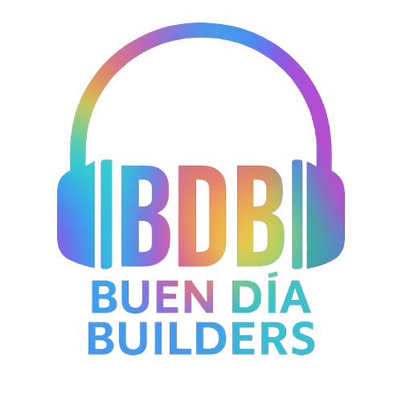
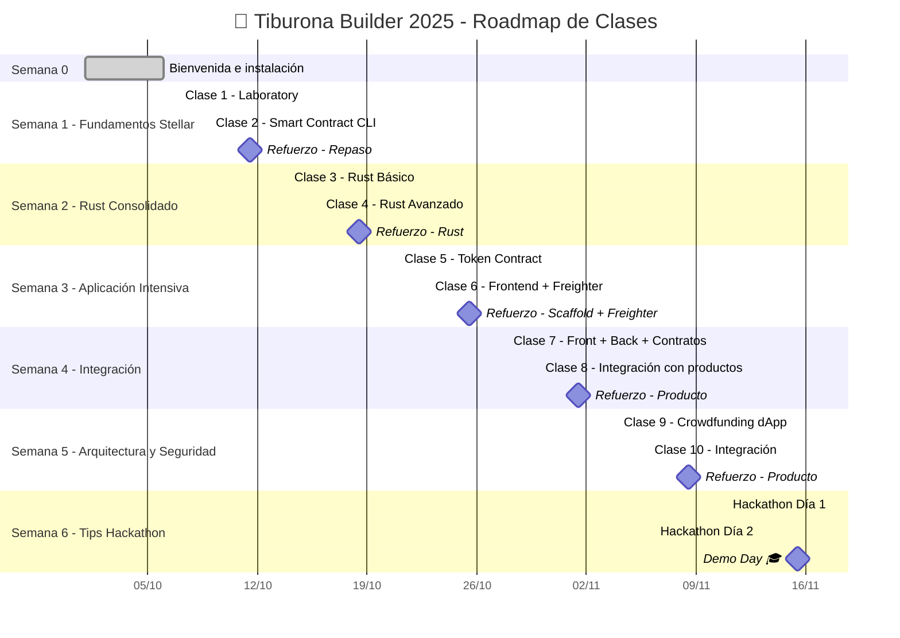

<div align="center">
<h1>Código Futura<br>| 🦈Conviértete en Tiburona Builder 2025🦈 |</h1>

<p align="center"><strong>De cero a desarrolladora blockchain en 7 semanas
</strong></p>

<p align="center">
    <br />
    <a href="https://buendiabuilders.com/">
        </a>
    <br />
</p>

**Bienvenida al programa que está formando a las próximas líderes de la tecnología blockchain en Latinoamérica** 🚀

</div>

---

## 🦈 ¿Qué es Ser una Tiburona Builder?

Las tiburonas son **poderosas**, **precisas**, **persistentes** y **pioneras**.

En este curso no solo vas a aprender teoría. Vas a:
- ✅ Escribir tu primer smart contract
- ✅ Deployar aplicaciones reales en blockchain
- ✅ Construir un portfolio que abre puertas
- ✅ Unirte a una comunidad de mujeres builders

**No necesitas experiencia previa.** Solo necesitas estar lista para construir.

---

## 🎯 ¿Por Qué Stellar?

Mientras otras blockchains prometen el futuro, Stellar ya lo está construyendo:

| Característica | Stellar | Ethereum | Bitcoin |
|----------------|---------|----------|---------|
| ⚡ Velocidad | 3-5 segundos | 15-300 seg | 10-60 min |
| 💰 Costo/tx | $0.00001 | $0.50-$50 | $1-$50 |
| 🌍 Enfoque | Pagos globales | DeFi general | Store of value |
| 🔧 Smart Contracts | Soroban (Rust) | Solidity | No nativo |
| 📱 Caso de uso real | Remesas, fintech | NFTs, DeFi | Reserva de valor |

---

## 🗺️ Roadmap de Clases (Octubre - Noviembre 2025)



**📊 Ver [Roadmap Detallado](./ROADMAP.md)**

---

## 📂 Estructura del Repositorio

```
stellar-course/
├── clase-0-bienvenida/          # Pregrabada
├── semana-1-fundamentos/        # Clases 1-2
├── semana-2-rust/               # Clases 3-4
├── semana-3-aplicacion/         # Clases 5-6 + Sábado
├── semana-4-integracion/        # Clases 7-8
├── semana-5-arquitectura/       # Clases 9-10
├── semana-6-hackathonTips/          # Clases 11-12
└── recursos/                    # Troubleshooting, Glosario
```

**💡 Cada carpeta tiene su propio README con instrucciones específicas.**

---

## 🎯 Objetivos de Aprendizaje

Al completar este curso, vas a poder:

**🌟 Semana 1-2:** Crear cuentas Stellar, transacciones programáticas, escribir Rust

**⚡ Semana 3-4:** Desarrollar tokens, frontend React, integrar contratos

**🏗️ Semana 5-6:** Arquitectura dApp, testing, security, tips productos

---

## 👩‍🏫 Equipo de Instructoras

| | |
|---|---|
| **Elisa Araya** | Co-fundadora BDB | [GitHub](https://github.com/mariaelisaaraya)
| **Tatiana Borda** | Co-fundadora BDB | [GitHub](https://github.com/tatianaborda)


---

## 💡 Mejores Prácticas

1. 📖 **Sigue el orden** - Progresión estructurada
2. 🧘 **Toma descansos** - 25 min trabajo, 5 min pausa
3. 🤝 **Participa** - Bienvenidas son las preguntas, ayuda a otras
4. 🔐 **Seguridad** - NUNCA compartas Secret Key
5. 🤖 **Usa IA** - ChatGPT/Claude como asistentes
6. 📝 **Toma notas** - En tu código
7. 🐛 **Errores = Aprendizaje** - Falla rápido
8. 🎯 **Resultados > Perfección** - Done is better than perfect
9. 🌊 **Celebra logros** - Cada paso cuenta
10. 🦈 **Sigue nadando** - Las Tiburonas no se detienen

---

## 🏆 Certificación

Al completar:
- 🎓 Certificado NFT en Stellar
- 📜 Badge de Tiburona Builder
- 🌟 Acceso a Red de Alumni
- 💼 Recomendación LinkedIn
- 🚀 Conexiones con proyectos Stellar

---

## ❓ FAQ

**Ver [FAQ Completo](./FAQ.md)**

---

## 🙏 Agradecimientos

**Patrocinadores:**
- Stellar Development Foundation (SDF)
- Blockchain Acceleration Foundation (BAF)

**Comunidad:**
- Contributors que mejoran este material
- Tú, por decidir construir con nosotras

---

## 📱 Comunidad

[](https://x.com/buendiabuilders)
[](https://www.youtube.com/@buendiabuilders)
[](https://www.linkedin.com/company/buen-dia-builders/)

---

## 🤝 Contribuir

¿Encontraste un error? ¿Tienes una sugerencia?

Lee nuestra [Guía de Contribución](./CONTRIBUTING.md) y [Código de Conducta](./CODE_OF_CONDUCT.md).

---


MIT License - Ver [LICENSE](./LICENSE) para más detalles.

Eres libre de usar, compartir, modificar y construir sobre este material.

---

## ⚠️ Disclaimer

**TODO el código es para fines educativos.**

✅ Seguro para Testnet

❌ NO usar en producción sin auditoría

**Usa siempre Testnet para practicar.**

---

<div align="center">

## 🚀 ¿Lista para Construir?


---


**#TiburonaBuilders** • **#StellarDevelopment** • **#Web3enEspañol**

---

**🦈⚡ Vamos a construir⚡🦈**

---

**Última actualización**: Octubre 2025 | **Versión**: 1.0
**Mantenido con 💙 por**: [Buen Día Builders](https://buendiabuilders.com)

[](https://stellar.org)
[](https://soroban.stellar.org)
[](https://rust-lang.org)

</div>
